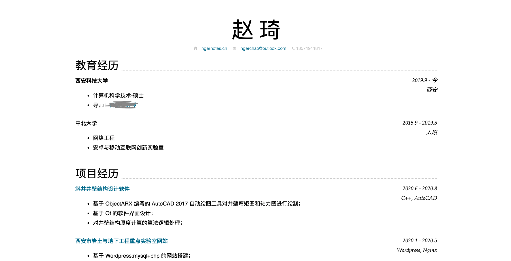

# ingernotes.cn
:blush: inger notes about cs, writing, etc.

theme support by [sergiokopplin/indigo](https://github.com/sergiokopplin/indigo).

---

## How it works

1. Install [Jekyll](https://jekyllrb.com/), [NodeJS](https://nodejs.org/) and [Bundler](https://bundler.io/).
2. Clone the forked repo on your machine;
3. Enter the cloned folder via terminal and run `bundle install` 
4. Then run `bundle exec jekyll serve --config _config.yml,_config-dev.yml`
5. Open it in your browser: `http://localhost:4000`

## Inside this blog more than Indigo

- [Inger notes](./posts): about computer science, computer vision, English learning notes, etc.
- [valine_comment](https://github.com/xCss/Valine): A fast, simple & powerful comment system.
- A search tool: find items by post title.
- [nimo-markdown-cv](https://github.com/wodeni/nimo-markdown-cv): to show my resume.
- Mathjax support.
- Chinese URL support.

## Maintainer

[@Inger](https://github.com/inger-chao)

