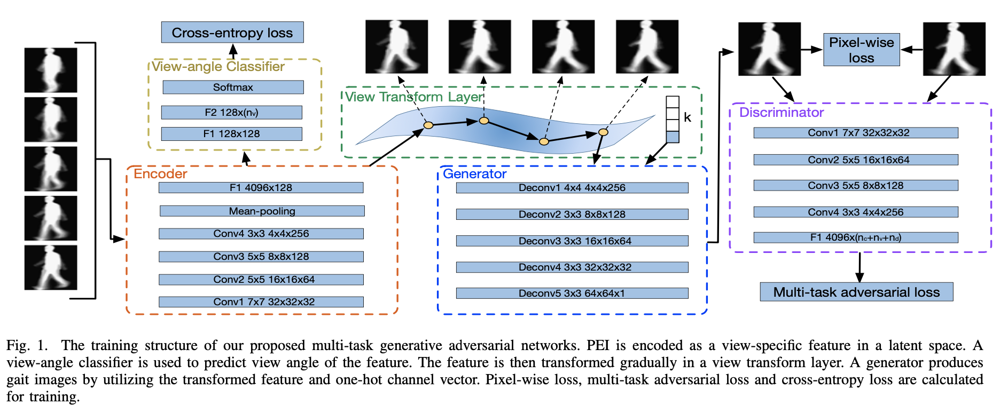
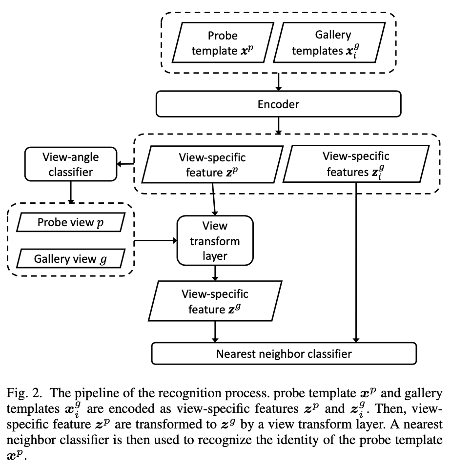

### Abstract

步态识别中现存问题

- 现有的交叉视角步态识别方法针对**从不同视角转换步态模版**再进行识别，因此会随着视角差异的变大而积累误差；
- 常用的 GEI 模版会丢失步态序列的时间信息。

本文提出了一种 **多任务生成对抗网络**，用于学习特定试图下的特征表示，利用对抗训练从步态序列中提取更多判别特征。同时提出了周期能量图像（Period Energy Image）。

实验数据集：OU-ISIR, CASIA-B, USF

### 1. Introduction

1. PEI：经过卷积神经网络提取特征；
2. 视角分类器：交叉熵损失训练视角分类器，判断输入序列属于哪个视角；
3. 
   现有的交叉视角步态识别方法针对**从不同视角转换步态模版**再进行识别，因此会随着视角差异的变大而积累误差；
4. 常用的 GEI 模版会丢失步态序列的时间信息。

本文提出了一种 **多任务生成对抗网络**，用于学习特定试图下的特征表示，利用对抗训练从步态序列中提取更多判别特征。同时提出了周期能量图像（Period Energy Image）。

实验数据集：OU-ISIR, CASIA-B, USF

### 1. Introduction

$
- $\{ z^g_i, ... \}$

- 视角分类器：得到 p 和 g
-  通过生成对抗网络生成 $x^p$ 对应的 $z^g$
- 再比较$\{ x^g \}$和 galerry 中每个图像的距离：

#### 3.2 Period Energy Image

#### 3.3 *Multi-task Generative Adversarial Network*

#### 3.4 Objective Function

### 4. Experiments

#### 4.1 Setup

#### 4.2 Effect of PEI

#### 4.3 *Effect of MGANs*

#### 4.4 *Evaluation of comparison*

#### 4.5 Gait Generation

#### 4.6 *Feature visualization*

### 5. Conclusion and Discussion

