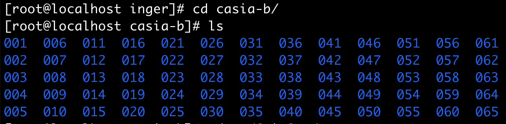
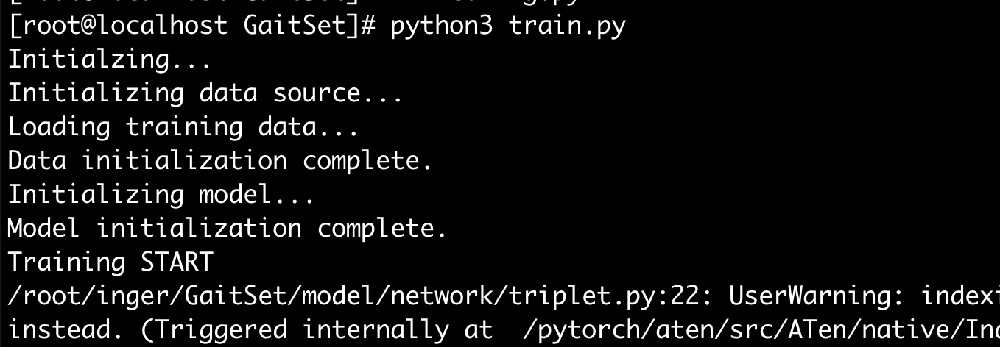

### 准备

- 数据集：申请 [CASIA-B](http://www.cbsr.ia.ac.cn/english/Gait%20Databases.asp) 数据集和 [OU-MVLP](http://www.am.sanken.osaka-u.ac.jp/BiometricDB/GaitMVLP.html) 两个数据库的解压密码
- 克隆[源代码 git 仓库](https://github.com/AbnerHqC/GaitSet)到本地
- [pytorch 环境配置](./../2020-09-17-linux-nvidia-cuda)

### 安装程序所需的依赖


```bash
# scipy
pip3 install scipy

# skbuild
pip3 install scikit-build

# cmake
pip3 install cmake

# opencv
pip3 install opencv-python
```


OpenCV for Python 有很长一段时间需要 Build，要等比较长一段时间。

Build 过程中出现问题，无法找到 Python.h，需要安装python-dev。

```bash
# 找一下 yum 里面叫什么， 不同的系统名称不一样
yum search python3 | grep devel

yum install python3-devel

# 重新安装 opencv, 可以使用清华源
pip3 install -i https://pypi.tuna.tsinghua.edu.cn/simple opencv-python
```

安装成功后，开始对图像进行预处理，将原图像剪裁为 64 * 64 的输入图像。

先将 CASIA-B 数据集整理为`your_dataset_path/subject_ids/walking_conditions/views`. E.g. `CASIA-B/001/nm-01/000/`. 这样的格式。




```bash
python3 pretreatment.py --input_path='/root/inger/casia-b' --output_path='/root/inger/cut-casia-b'
```


出现问题：`AttributeError: module 'scipy.misc' has no attribute 'imsave'`，原因是`Python 3`中的`scipy`库/模块中`imsave()`，`imread()`等方法在新版本`(scipy 1.4.1)`中被弃用了，虽然降版本（手动安装`scipy 1.2.1`或更低版本）可以，但是可以用`Python3`中其它模块代替使用。


```bash
pip3 install imageio
```

修改`pretreatment.py`

```python
# from scipy import misc as scisc
import imageio

# scisc.imsave(save_path, img)
imageio.imsave(save_path, img)
```

重新运行： 

```bash
[root@localhost GaitSet]# python3 pretreatment.py --input_path='/root/inger/casia-b' --output_path='/root/inger/cut-casia-b'
Pretreatment Start.
Input path: /root/inger/casia-b
Output path: /root/inger/cut-casia-b
Log file: ./pretreatment.log
Worker num: 1
# JOB 0 : --START-- 001-bg-01-000
# JOB 0 : --FINISH-- Contain 89 valid frames. Saved to /root/inger/cut-casia-b/001/bg-01/000.
```

修改 `config.py` 中的数据集路径为自己的路径。

然后训练模型

```bash
python3 train.py
```

出现 bug：

```python
# python3 train.py
Initialzing...
Initializing data source...
/usr/local/lib64/python3.6/site-packages/numpy/core/_asarray.py:136: VisibleDeprecationWarning: Creating an ndarray from ragged nested sequences (which is a list-or-tuple of lists-or-tuples-or ndarrays with different lengths or shapes) is deprecated. If you meant to do this, you must specify 'dtype=object' when creating the ndarray
  return array(a, dtype, copy=False, order=order, subok=True)
Traceback (most recent call last):
  File "train.py", line 18, in <module>
    m = initialization(conf, train=opt.cache)[0]
  File "/root/inger/GaitSet/model/initialization.py", line 57, in initialization
    train_source, test_source = initialize_data(config, train, test)
  File "/root/inger/GaitSet/model/initialization.py", line 15, in initialize_data
    train_source, test_source = load_data(**config['data'], cache=(train or test))
  File "/root/inger/GaitSet/model/utils/data_loader.py", line 42, in load_data
    pid_list = np.load(pid_fname)
  File "/usr/local/lib64/python3.6/site-packages/numpy/lib/npyio.py", line 440, in load
    pickle_kwargs=pickle_kwargs)
  File "/usr/local/lib64/python3.6/site-packages/numpy/lib/format.py", line 727, in read_array
    raise ValueError("Object arrays cannot be loaded when "
ValueError: Object arrays cannot be loaded when allow_pickle=False
```

numpy 需要降级：

```bash
# pip3 show numpy
Name: numpy
Version: 1.19.2

pip3 install numpy==1.16.1

[root@localhost GaitSet]# python3 train.py
Initialzing...
Initializing data source...
Loading training data...
```



