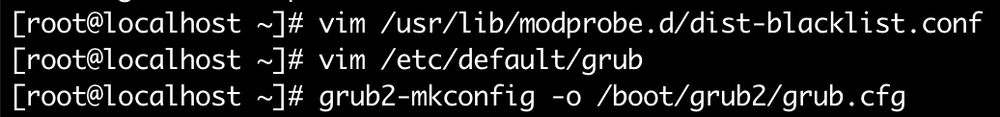
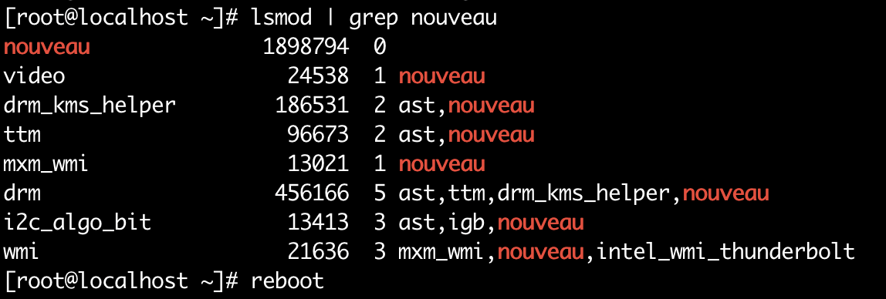
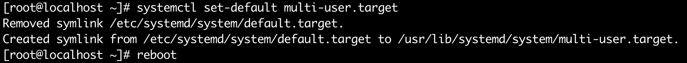
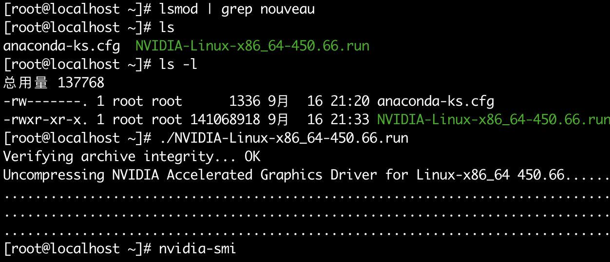
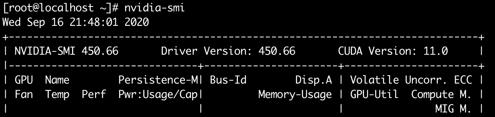
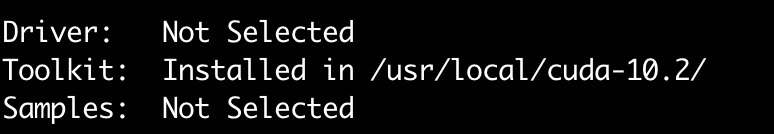
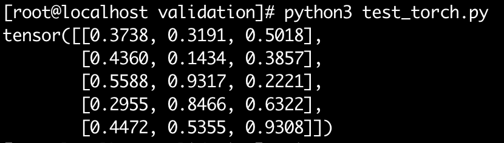
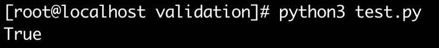

 [在服务器虚拟机上无法使用 GPU 资源](https://www.ingernotes.cn/linux-pytorch/)，运维说可能是 pass through 的透传问题，一周多时间并没有什么好的解决方案，但物理机上可用，故在物理机中配置 pytorch 环境。系统为 Centos8


### 物理机安装Nvidia GPU驱动

（1）    更新kernel版本

```bash
yum install kernel
yum install kernel-devel
```

（2）    安装gcc和gcc++

```bash
yum -y install gcc gcc-c++ 
```

（3）    重启

```bash
reboot
```

（4）    禁用默认带有的nouveau

```bash
vim /usr/lib/modprobe.d/dist-blacklist.conf
```

注释 `nvidiafb`一行

在文件最后添加

```bash
blacklist nouveau

options nouveau modeset=0
```

编辑 `/etc/default/grub`

```bash
vim /etc/default/grub
```

将 rd.driver.blacklist=nouveau nouveau.modeset=0 添加到GRUB_CMDLINE_LINUX

```bash
# 之前
GRUB_CMDLINE_LINUX="crashkernel=auto rd.lvm.lv=centos/root rd.lvm.lv=centos/swap rhgb quiet"

# 添加完后
GRUB_CMDLINE_LINUX="crashkernel=auto rd.lvm.lv=centos/root rd.lvm.lv=centos/swap rhgb quiet rd.driver.blacklist=nouveau nouveau.modeset=0"
```

让配置生效

```bash
grub2-mkconfig -o /boot/grub2/grub.cfg
```




此时使用 `lsmod | grep nouveau` 查看 nouveau 是有东西的说明还没被禁用



```bash
reboot # 重启
```


（5）    重建initramfs image


```bash
mv /boot/initramfs-$(uname -r).img /boot/initramfs-$(uname -r).img.bak
dracut /boot/initramfs-$(uname -r).img $(uname -r) 
```


（6）    修改运行级别

```bash
systemctl set-default multi-user.target 
```



（7）    重启

```bash
reboot 
```


（8）    查看nouveau是否已经禁用

```bash
lsmod | grep nouveau 
```

如果没有显示相关的内容，说明已禁用



（9）    安装显卡驱动（具体驱动文件，根据具体显卡型号变换）

\# cd /root/cDeep/Nvidia/# chmod +x [NVIDIA-Linux-x86_64-375.39.run#](NVIDIA-Linux-x86_64-375.39.run#) ./[NVIDIA-Linux-x86_64-375.39.run](NVIDIA-Linux-x86_64-375.39.run) 

如果询问是否安装安装32位驱动，选择no

如果提示要修改xorg.conf，选择yes

（10）  重启

\# reboot 

（11）  查看GPU信息

```bash
nvidia-smi
```




### CUDA 安装

```bash
sh cuda_10.2.89_440.33.01_linux.run
tar -xvf cudnn-10.2-linux-x64-v7.6.5.32.tgz
```

第一个选择输入“accept”， 后续只选择 Cuda ToolKit, Then Install



**配置环境变量**：

````bash
vim /etc/profile


# 添加下面两行
export LD_LIBRARY_PATH="$LD_LIBRARY_PATH:/usr/local/cuda/lib64" 
export CUDA_HOME=/usr/local/cuda

# 令配置生效
source /etc/profile

# 查看 CUDA 版本
cat /usr/local/cuda/version.txt
CUDA Version 10.2.89

````


### 安装 python3 和 pytorch


```bash
yum install python3

pip3 install -i https://pypi.tuna.tsinghua.edu.cn/simple torch
```


检查 pytorch 是否安装成功


```bash
vim test_torch.py

# test_torch.py
from __future__ import print_function
import torch
x = torch.rand(5, 3)
print(x)

# 运行 test_torch.py， 结果如下图表示 pytorch 安装成功
python3 test_torch.py

```




```bash
vim test_cuda.py

## test_cuda.py

import torch
print(torch.cuda.is_available())

# 运行 test_cuda.py, 输出为 True 表示 CUDA、显卡驱动 安装成功
python3 test_cuda.py
```

