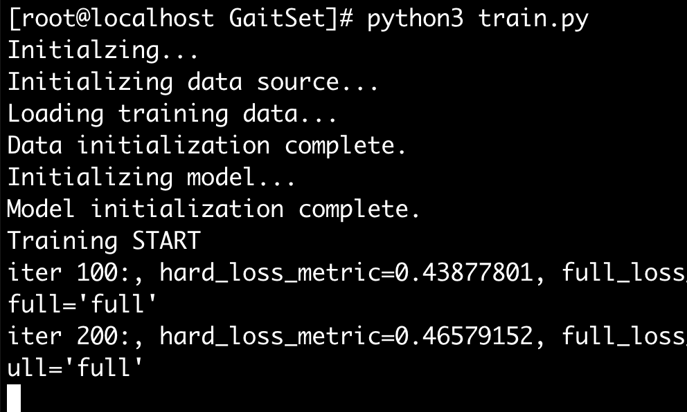

### 准备工作

- 申请中科院 CASIA 步态数据集
- 将数据集传输至服务器
- CASIA-A 是一个只有 20 个个体，00、45、90三个视角的室外简易数据集

### 数据集列表处理

需要将 CASIA -A 文件夹处理为 GaitSet 可以处理的方式：`your_dataset_path/subject_ids/walking_conditions/views`. E.g. `CASIA-B/001/nm-01/000/`. 这样的格式。

```bash
for dir in `ls`; 
do 
	for i in `seq -w 4`; 
	do
		mkdir $dir/nm_$i;
  	mv $dir/00_$i $dir/nm_$i; 
  	mv $dir/45_$i $dir/nm_$i;
  	mv $dir/90_$i $dir/nm_$i; 
  done; 
done

for dir in `ls`; 
do 
	for i in `seq -w 4`; 
	do 
		mv $dir/nm_$i/00_$i $dir/nm_$i/00; 
		mv $dir/nm_$i/45_$i $dir/nm_$i/45;
		mv $dir/nm_$i/90_$i $dir/nm_$i/90; 
	done; 
done
```

处理完之后是这样子的：

```bash
# 展示部分，满足subject id/walking condition/view
└── zyf
    ├── nm_1
    │   ├── 00
    │   ├── 45
    │   └── 90
    ├── nm_2
    │   ├── 00
    │   ├── 45
    │   └── 90
    ├── nm_3
    │   ├── 00
    │   ├── 45
    │   └── 90
    └── nm_4
        ├── 00
        ├── 45
        └── 90
```


训练过程中一直出现警告：

```python
[W LegacyDefinitions.cpp:55] Warning: masked_scatter_ received a mask with dtype torch.uint8, this behavior is now deprecated,please use a mask with dtype torch.bool instead. (function masked_scatter__cuda)
```

解放方案：修改 `model/network/triplet.py`中的代码。

```python
        # hp_mask = (label.unsqueeze(1) == label.unsqueeze(2)).byte().view(-1)
        # hn_mask = (label.unsqueeze(1) != label.unsqueeze(2)).byte().view(-1)
    
        hp_mask = (label.unsqueeze(1) == label.unsqueeze(2)).bool().view(-1)
        hn_mask = (label.unsqueeze(1) != label.unsqueeze(2)).bool().view(-1)
```

修改后成功解决警告一直提示的问题，警告一直print 也会影响训练速度。

```bash
Initializing model...
Model initialization complete.
Training START
iter 100:, hard_loss_metric=0.43877801, full_loss_metric=0.18684836, full_loss_num=150068.31250000, mean_dist=0.32679194, lr=0.000100, hard or full='full'
iter 200:, hard_loss_metric=0.46579152, full_loss_metric=0.16899489, full_loss_num=61181.48046875, mean_dist=0.79742897, lr=0.000100, hard or full='full'
iter 300:, hard_loss_metric=0.38517371, full_loss_metric=0.15730542, full_loss_num=29512.56445312, mean_dist=1.20579135, lr=0.000100, hard or full='full'
iter 400:, hard_loss_metric=0.32034317, full_loss_metric=0.15453504, full_loss_num=16854.20117188, mean_dist=1.54718614, lr=0.000100, hard or full='full'
iter 500:, hard_loss_metric=0.26299983, full_loss_metric=0.15403123, full_loss_num=10409.87207031, mean_dist=1.85012400, lr=0.000100, hard or full='full'
Training COMPLETE
```





修改 `test.py`:


```python
# dataset = config['dataset'].split('-')[0]
dataset = config['dataset']

probe_seq_dict = {'CASIA-B': [['nm-05', 'nm-06'], ['bg-01', 'bg-02'], ['cl-01', 'cl-02']],
                  'OUMVLP': [['00']], 'CASIA-A': [['nm_1']]}
gallery_seq_dict = {'CASIA-B': [['nm-01', 'nm-02', 'nm-03', 'nm-04']],
                    'OUMVLP': [['01']], 'CASIA-A': [['nm_2', 'nm_3', 'nm_4']]}

# 中间代码不变

for i in range(1):
    print('===Rank-%d (Include identical-view cases)===' % (i + 1))
    print('NM: %.3f' % (
        np.mean(acc[0, :, :, i])))

for i in range(1):
    print('===Rank-%d (Exclude identical-view cases)===' % (i + 1))
    print('NM: %.3f' % (
        de_diag(acc[0, :, :, i])))

np.set_printoptions(precision=2, floatmode='fixed')
for i in range(1):
    print('===Rank-%d of each angle (Exclude identical-view cases)===' % (i + 1))
    print('NM:', de_diag(acc[0, :, :, i], True))
```

测试 CASIA-A 数据集用 GaitSet 迭代 500 次的效果：

``` bash
[root@localhost GaitSet]# python3 test_a.py
Initialzing...
Initializing data source...
Data initialization complete.
Initializing model...
Model initialization complete.
Loading the model of iteration 500...
Transforming...
Evaluating...
Evaluation complete. Cost: 0:00:00.629230
===Rank-1 (Include identical-view cases)===
NM: 87.222
===Rank-1 (Exclude identical-view cases)===
NM: 16.833
===Rank-1 of each angle (Exclude identical-view cases)===
NM: [18.00 20.00 12.50]
```

```bash
Loading the model of iteration 2...
Transforming...
Evaluating...
Evaluation complete. Cost: 0:00:21.357544
===Rank-1 (Include identical-view cases)===
NM: 64.444
===Rank-1 (Exclude identical-view cases)===
NM: 10.000
===Rank-1 of each angle (Exclude identical-view cases)===
NM: [10.00 12.50  7.50]
```


```bash
Loading the model of iteration 10...
Transforming...
Evaluating...
Evaluation complete. Cost: 0:00:21.843741
===Rank-1 (Include identical-view cases)===
NM: 67.222
===Rank-1 (Exclude identical-view cases)===
NM: 10.833
===Rank-1 of each angle (Exclude identical-view cases)===
NM: [10.00 15.00  7.50]
```


```bash
Loading the model of iteration 500...
Transforming...
Evaluating...
Evaluation complete. Cost: 0:00:00.629230
===Rank-1 (Include identical-view cases)===
NM: 87.222
===Rank-1 (Exclude identical-view cases)===
NM: 16.833
===Rank-1 of each angle (Exclude identical-view cases)===
NM: [18.00 20.00 12.50]
```


```bash
Loading the model of iteration 2700...
Transforming...
Evaluating...
Evaluation complete. Cost: 0:00:00.892912
===Rank-1 (Include identical-view cases)===
NM: 90.000
===Rank-1 (Exclude identical-view cases)===
NM: 17.667
===Rank-1 of each angle (Exclude identical-view cases)===
NM: [18.00 20.00 15.00]
```

