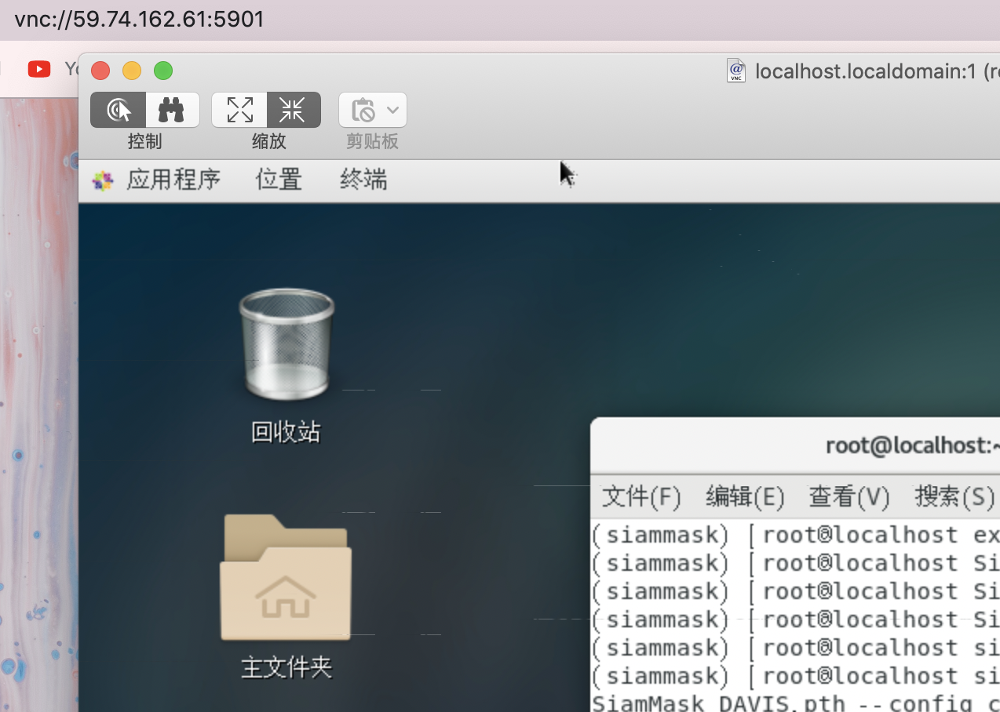

昨天晚上在 Youtube 的 [augmentedstartups](https://github.com/augmentedstartups) 频道看到一个关于 ObjectTracking 的项目，感觉效果非常不错，便想要跟着学习一下。视频中实现的是 SiamMask 的应用，点进 [Git Repo](https://github.com/augmentedstartups/SiamMask) 发现有完整的复现过程，非常清晰，于是今天到实验室就跟着做了一下。

### 实验环境【Environment】

Demo 中提供的实验环境是 Ubuntu 16.04, Python 3.6, Pytorch 0.4.1, CUDA 9.2, RTX 2080 GPUs，以下是我所用的实验室服务器环境。

- CentOS 7
- Anaconda3
- Cuda 10.2.89, NVIDIA Corporation GM200 [GeForce GTX TITAN X]

首先实验室的服务器是不具备图形界面的，要展示视频/图像必须为系统配置图形化界面，参考[博客](https://www.jianshu.com/p/bdaf15ebe8db)安装 GNOME 桌面环境并配置 VNC-Server，一切安装好之后便可以在个人机中查看图形界面。



[安装 anaconda3](https://www.linuxcloudvps.com/blog/how-to-install-anaconda-python-on-centos-7/) 并新建一个 siammask 虚拟环境。

### 运行步骤

- 克隆该仓库

```bash
git clone https://github.com/foolwood/SiamMask.git && cd SiamMask
export SiamMask=$PWD
```

- 安装需要的 python 环境和依赖库

```bash
conda create -n siammask python=3.6
source activate siammask
pip install -r requirements.txt
bash make.sh
```

- 将项目路径添加到 PYTHONPATH 中

```
export PYTHONPATH=$PWD:$PYTHONPATH
```

> ⚠️注意：此时 export 的环境变量只在一个终端中有效，如果重启另一个终端运行需要重新声明环境变量，虚拟环境也是类似的。

- 下载预训练模型

```bash
cd $SiamMask/experiments/siammask_sharp
wget http://www.robots.ox.ac.uk/~qwang/SiamMask_VOT.pth
wget http://www.robots.ox.ac.uk/~qwang/SiamMask_DAVIS.pth
```

- 运行 `demo.py`

```bash
cd $SiamMask/experiments/siammask_sharp
export PYTHONPATH=$PWD:$PYTHONPATH
python ../../tools/demo.py --resume SiamMask_DAVIS.pth --config config_davis.json
```

> ⚠️注意：运行之前的步骤都可以在 ssh 终端中进行，但执行 demo.py 必须在图形化界面的终端中调用，否则会出现错误。

鼠标选中目标后空格/回车开始追踪，便可得到理想的实验效果。


-----

**Fast Online Object Tracking and Segmentation: A Unifying Approach**
[Qiang Wang](http://www.robots.ox.ac.uk/~qwang/)*, [Li Zhang](http://www.robots.ox.ac.uk/~lz)*, [Luca Bertinetto](http://www.robots.ox.ac.uk/~luca)*, [Weiming Hu](https://scholar.google.com/citations?user=Wl4tl4QAAAAJ&hl=en), [Philip H.S. Torr](https://scholar.google.it/citations?user=kPxa2w0AAAAJ&hl=en&oi=ao) (* denotes equal contribution)
**CVPR 2019**
**[[Paper](https://arxiv.org/abs/1812.05050)] [[Video](https://youtu.be/I_iOVrcpEBw)] [[Project Page](http://www.robots.ox.ac.uk/~qwang/SiamMask)]**

