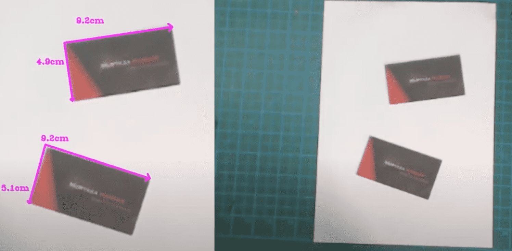
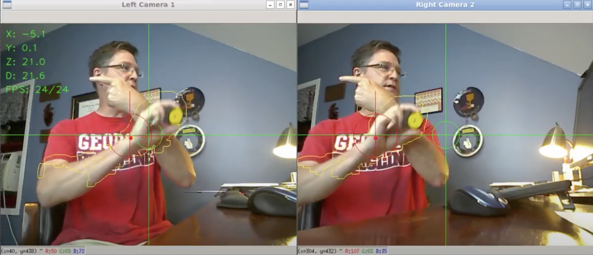

这篇 Posts 主要用于记录自己在 Youtube 上看的一些小 demo。


### Real Time Object Measurement

实现的效果是 以 A4 纸为参考物，提取 A4 纸的边缘并测量小于 A4 纸的矩形物体的长和宽。实现效果如下图所示：



用到了勾股定理根据三角形计算边长的。

```flow
	s=>start: Image
	e=>end: 获得物体尺寸
	o1=>operation: Gray
	o2=>operation: 高斯模糊
	o3=>operation: Canny edge Detector
	o4=>operation: 形态学处理（开闭操作）
	o5=>operation: 提取轮廓
	o6=>operation: 遍历轮廓找到最大 A4 纸作为参考
	o7=>operation: 将矩阵的四个点重新排序
	s->o1->o2(right)->o3->o4(right)->o5->o6->o7->e
```


### Stereovision Distance Measurement




视频中介绍了双目测距原理。

---

Links:

- [Real time object measurement](https://www.youtube.com/watch?v=tk9war7_y0Q)
- [source code1]( https://www.murtazahassan.com/courses/opencv-projects/lesson/lesson-4/)
- [Distance](https://www.youtube.com/watch?v=sW4CVI51jDY)
- [source code2]()

