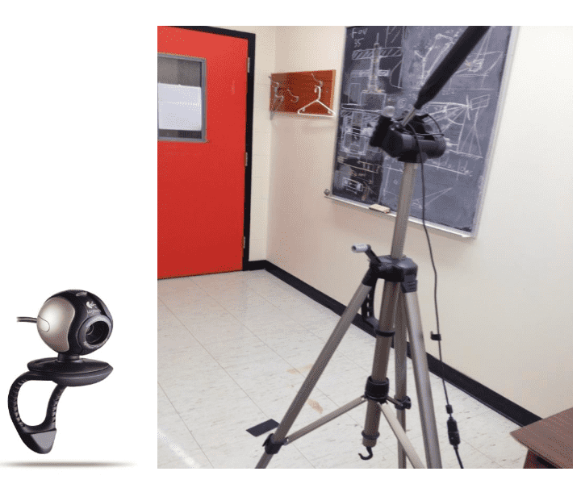

这是 2015年加拿大 Laurentian University 硕士生的毕业论文，主要介绍了使用单个相机测量物体的距离、长度、宽度信息的相关方法。我阅读了 Abstract, Chapter 4, Chapter 5，摘要和两种测量方法的介绍。本文介绍的方法可以测量移动中的物体，但相机的位置是要求固定的。

### Abstract

对视觉控制系统来说，距离、长度、宽度等参数的提取是非常重要的。目前主要有三种基于图像的物体距离测量技术：1) **双目摄像头**, 2) **单目摄像头**, 3)**TOF 相机（3D 图像传感器）**。

双目摄像头的测量精度较高，但所需的计算资源较大，随着距离越来越远，还会产生目标物体无法校准的情况。TOF 相机通过计算光线从发出到从物体折射回来所用的时间来计算距离，所以 TOF 相机还要考虑障碍物躲避等问题，受光强的影响较大。单目相机计算距离所需的计算资源很少，且程序复杂度远远低于其他方法。

目前基于单目相机的测距和特征提取（比如长度或宽度等参数）并没有被深入研究，也很少有公开的项目或文献。

本文主要提出了两种改进的单目测距方法，一种针对摄像机在垂直平面上固定以给定角度拍摄的情况，另一种针对摄像头在垂直平面中旋转的情况（方向校正、长度校正、宽度校正）。

实验结果表明距离测量精度从 9.4 mm 提升到了 2.95mm，长度测量精度从 11.6 mm 提升到了 2.2mm，宽度测量精度从 18.6mm 提升到了10.8mm。本文提出的方法简单有效，可用于实时的机器人系统，还可以用于家庭、办公室等场所。

### Object Distance Measurement Using a Single Fixed Camera

将相机固定，放置一些物体在地面上，测量了计算器、矩形块、玩具小车的长度，相机的分辨率是 640 $\times$ 480，非常固定，也是用的传统的灰度化、二值化、边缘检测等操作，以小孔成像模型为依据，然后根据基本的相似三角形、三角函数等计算距离，物体的长宽参数是以图像坐标系的底边中点为原点进行计算。需要提前已知的参数有摄像机的高度、偏转角、相机的校准系数等。所以条件还是比较苛刻的。

### with variable pitch angle

通过变螺距角解决旋转摄像头对物体距离的测量。由于物体和摄像头的距离不断变化，物体的大小在图中会有所不同，所以引入了图像坐标中的 X-Y Correction 用于校准距离对物体长宽测量带来的影响。但是这个校正的参数和过程有点复杂，是纯手动的，通过记录像素点和物体和摄像头的距离来观测，统计后得到的线性函数。

---

References: 

- [pdf source]([https://zone.biblio.laurentian.ca/bitstream/10219/2458/1/Peyman%20Alizadeh%20MSc.%20Thesis%20Corrected_2_2.pdf](https://zone.biblio.laurentian.ca/bitstream/10219/2458/1/Peyman Alizadeh MSc. Thesis Corrected_2_2.pdf))
- [git issue](https://github.com/paul-pias/Object-Detection-and-Distance-Measurement/issues/3)

