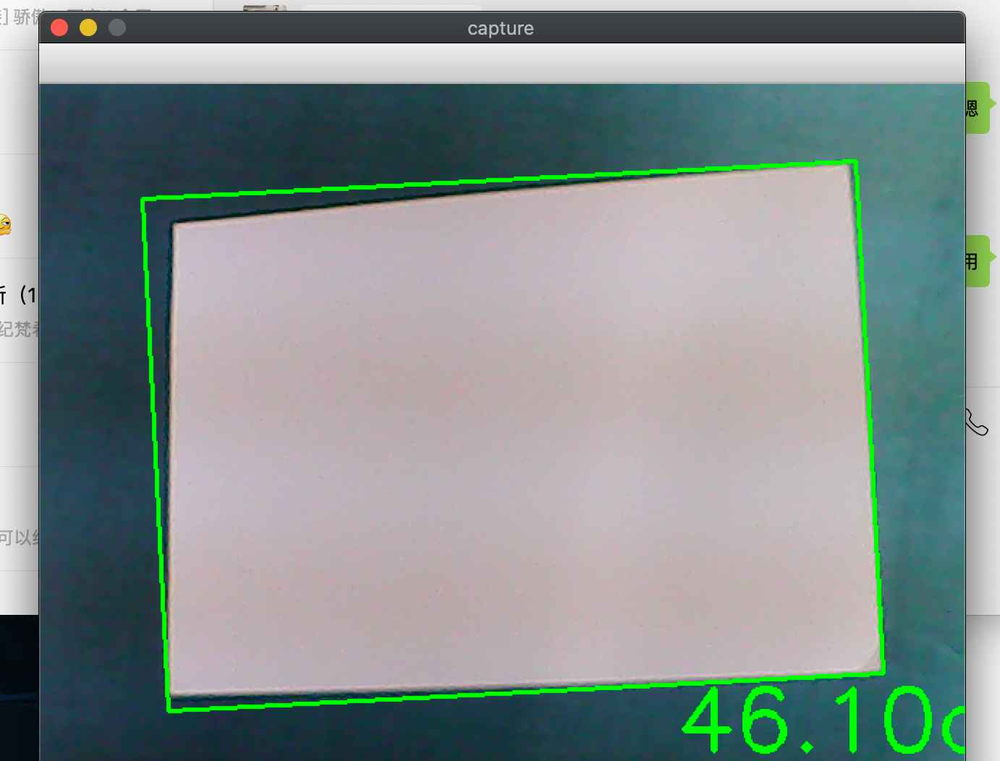

### 相机标定


三维真实世界到二维可以理解为通过一定的函数变换得到的，那么二维到三维通过一个反函数可以实现；相机标定的目的是通过找到一个数学模型，求出这个模型的参数。「相机标定」就是**通过数学模型表达复杂的成像过程，并且可以用于表示成像的反过程**。

标定之后的相机可以进行三维场景的重建，通过感知到的深度构建。

将 ObjectPoint 称为物点（三维点），ImagePoint 称为像点（二维点）。

通过相机标定可以得到？

1. *外参数矩阵*：现实世界点(世界坐标)是怎样经过旋转和平移，然后落到另一个现实世界点(摄像机坐标)上的；
2. *内参数矩阵*：物点如何继续经过摄像机的镜头、并通过针孔成像和电子转化而成为像素点；
3. *畸变矩阵*：物点为何偏移。

#### 针孔相机模型的描述

对相机成像过程进行简化和建模，得到如下的针孔相机模型，本质上就是把相机简化为小孔成像。


首先建立**相机坐标系**，以光心 O 为 坐标系原点，X 与 Y 方向是 CCD 像素排列的水平和竖直两个方向，Z 方向垂直于 [CCD 面](https://baike.baidu.com/item/CCD%E7%9B%B8%E6%9C%BA)，建立右手坐标系。其次，建立 CCD 标号坐标系，以 CCD 左上角像素标号为原点，CCD 像素排列的水平和竖直两个方向为 U 与 V 方向。


- 由光心 O 沿着光轴出发，像平面在 $Z = f$ 上，$f$ 为相机的物理焦距（单位：$mm$）；
- 点 Q 在物理空间中，在相机坐标系下的位置为 $Q(X, Y, Z)$；
- 点 P 在像平面上
  - 在相机坐标系下的位置是 $P(x,y,z)$；
  - 在 CCD 标号坐标系下的位置是 $P(u_{ccd}, v_{ccd})$；

在无镜头畸变的条件下，光心 O、点 P 和点 Q 在一条直线上。

- $k, l$ 是 CCD 单个像素在水平和竖直两个方向上的尺寸（单位：$mm / pixel$ ），因此定义焦距为 $f_x = \frac{f}{k}, f_y=\frac{f}{l}$  （单位：像素）;
- CCD 标号坐标系原点到光轴的偏移量为 $c_x,\ c_y$ （单位：像素）;
- 根据相似三角形关系原理可以得出：

$$
{
\begin{cases}
u_{ccd} = f_x(\frac{X}{Z} + c_x) \\
v_{ccd} = f_y(\frac{Y}{Z} + c_y)
\end{cases}
}
$$

> 成像原理理论知识先不看了，看看 OpenCV 相机标定应该怎么用。

#### OpenCV 官方文档

> Finds the camera intrinsic and extrinsic parameters from several views of a calibration pattern.

从校准图案的多个视图中查找相机的固有参数和外部参数。

```c++
double calibrateCamera(InputArrayOfArrays objectPoints, InputArrayOfArrays imagePoints, Size imageSize, InputOutputArray cameraMatrix, InputOutputArray distCoeffs, OutputArrayOfArrays rvecs, OutputArrayOfArrays tvecs, int flags=0, TermCriteria criteria=TermCriteria( TermCriteria::COUNT+TermCriteria::EPS, 30, DBL_EPSILON) )¶
```

方法作用：估算每个视图下相机的固有参数和外部参数。在每个视图下，3D object points 和他们相关的 2D image Points 必须明确。

参数列表：

- objectPoints（3D 点）：
- imagePoints（2D 点）：

> 暂时没看懂，先放一放


### 单目相机测距

#### 原理


根据相似三角形计算单目相机到物体的距离，必须已知一个确定的长度。

假设我们有一个宽度为 W 的目标或者物体。然后我们将这个目标放在距离我们的相机为 D 的位置。我们用相机对物体进行拍照并且测量物体的像素宽度 P 。这样我们就得出了相机焦距的公式：$F= \frac{P\times{D}}{W}$

当我们将摄像头远离或者靠近A4纸时，就可以用相似三角形得到相机距离物体的距离。
此时的距离：$D' = \frac{W'\times{F}}{P'}$。

#### 实现Demo

必须输入一张已知相机距离的图像，然后使用相机标定算法得到位置图像距离摄像头的距离。

使用 Picture4 图像作为输入，实现了简单背景下的 A4纸 距离检测。


具体 demo 如下：

```python
#!usr/bin/python
# -*- coding: utf-8 -*-
# 定义编码，中文注释

# import the necessary packages
import numpy as np
import cv2


# 找到目标函数
def find_marker(image):
    # convert the image to grayscale, blur it, and detect edges
    gray = cv2.cvtColor(image, cv2.COLOR_BGR2GRAY)
    gray = cv2.GaussianBlur(gray, (5, 5), 0)
    edged = cv2.Canny(gray, 35, 125)

    # find the contours in the edged image and keep the largest one;
    # we'll assume that this is our piece of paper in the image
    (cnts, _) = cv2.findContours(edged.copy(), cv2.RETR_LIST, cv2.CHAIN_APPROX_SIMPLE)
    # (_, cnts, _) = cv2.findContours(edged.copy(), cv2.RETR_LIST, cv2.CHAIN_APPROX_SIMPLE)
    # 求最大面积
    c = max(cnts, key=cv2.contourArea)

    # compute the bounding box of the of the paper region and return it
    # cv2.minAreaRect() c代表点集，返回rect[0]是最小外接矩形中心点坐标，
    # rect[1][0]是width，rect[1][1]是height，rect[2]是角度
    return cv2.minAreaRect(c)


# 距离计算函数
def distance_to_camera(knownWidth, focalLength, perWidth):
    # compute and return the distance from the maker to the camera
    return (knownWidth * focalLength) / perWidth


# 初始化 A4 纸距离摄像头的距离
# initialize the known distance from the camera to the object, which
# in this case is 24 inches
KNOWN_DISTANCE = 20.0

# initialize the known object width, which in this case, the piece of
# paper is 11 inches wide
# 初始化 A4 纸的长和宽(单位:inches)
KNOWN_WIDTH = 11.3
KNOWN_HEIGHT = 8.4

# initialize the list of images that we'll be using
IMAGE_PATHS = ["Picture1.jpg", "Picture2.jpg", "Picture4.jpg"]

# load the furst image that contains an object that is KNOWN TO BE 2 feet
# from our camera, then find the paper marker in the image, and initialize
# the focal length
# 读入第一张图，通过已知距离计算相机焦距
image = cv2.imread(IMAGE_PATHS[2])
marker = find_marker(image)
focalLength = (marker[1][0] * KNOWN_DISTANCE) / KNOWN_WIDTH

# 通过摄像头标定获取的像素焦距
# focalLength = 811.82
print('focalLength = ', focalLength)

# 打开摄像头
camera = cv2.VideoCapture(0)

while camera.isOpened():
    # get a frame
    (grabbed, frame) = camera.read()
    marker = find_marker(frame)
    if marker == 0:
        print(marker)
        continue
    inches = distance_to_camera(KNOWN_WIDTH, focalLength, marker[1][0])

    # draw a bounding box around the image and display it
    # box = np.int0(cv2.cv.BoxPoints(marker))
    box = cv2.boxPoints(marker)
    box = np.int0(box)
    cv2.drawContours(frame, [box], -1, (0, 255, 0), 2)

    # inches 转换为 cm
    cv2.putText(frame, "%.2fcm" % (inches * 30.48 / 12),
                (frame.shape[1] - 200, frame.shape[0] - 20), cv2.FONT_HERSHEY_SIMPLEX,
                2.0, (0, 255, 0), 3)

    # show a frame
    cv2.imshow("capture", frame)
    if cv2.waitKey(1) & 0xFF == ord('q'):
        break
camera.release()
cv2.destroyAllWindows()

```

实验结果：



---

参考资料：

- [相机标定究竟在标定什么？](https://zhuanlan.zhihu.com/p/30813733)
- [OpenCV 2.4.6 官方文档](https://docs.opencv.org/2.4.6/modules/calib3d/doc/camera_calibration_and_3d_reconstruction.html#calibratecamera)
- [【立体视觉】世界坐标系、相机坐标系、图像坐标系、像素坐标系之间的关系](https://blog.csdn.net/u011574296/article/details/73658560)
- [摄像头单目测距原理及实现](https://www.cnblogs.com/wujianming-110117/p/12822331.html)
- [单目摄像机测距（python+opencv）](https://blog.csdn.net/m0_37811342/article/details/80394935)
- [实时单目测距](https://zhuanlan.zhihu.com/p/42085600)

