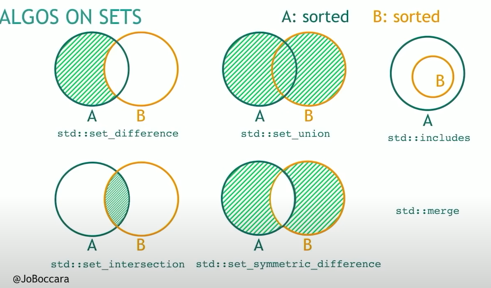
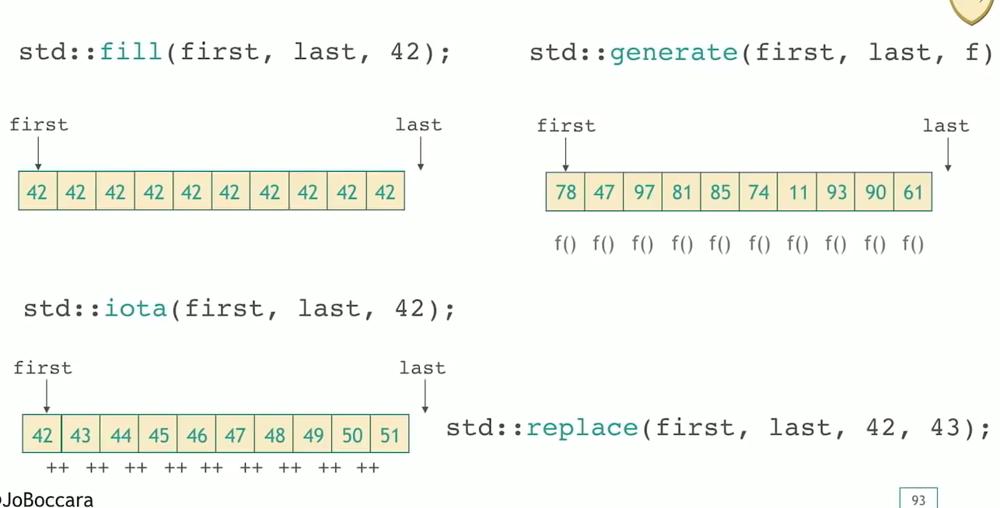
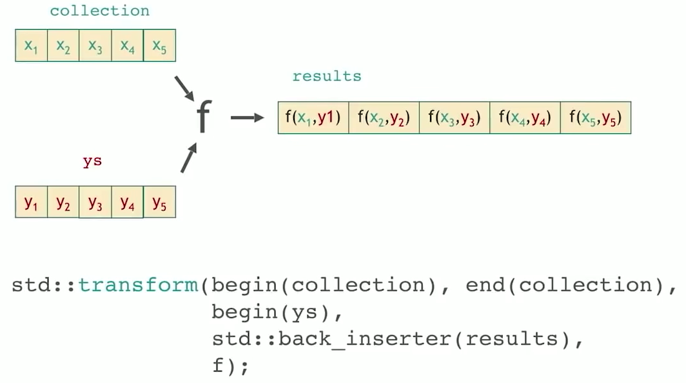
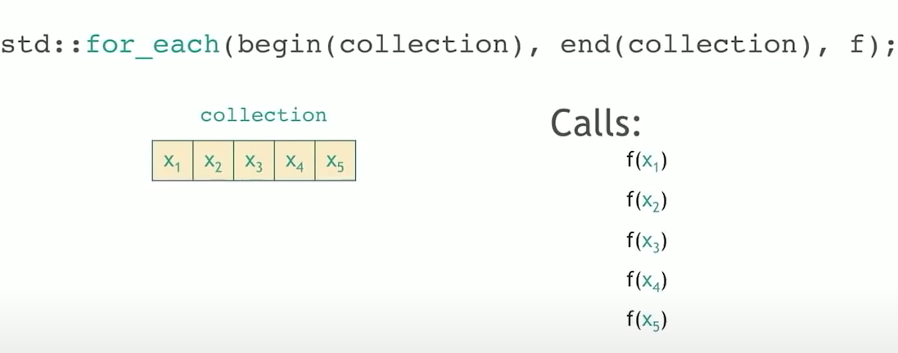

配套食用：[The C++ Conference bellevue 2018](https://www.youtube.com/watch?v=bFSnXNIsK4A)

-----

这是 2018 年 CPPCon 会议的演讲，从 STL 的优点开始讲起，从 for_each 说起，展示了了一张 STL algorithms 地图【基于权力的游戏地图】，包含了 C++ 17 以来的所有 STL 算法。今日目标：眼熟 STL algorithms 库有哪些算法就算成功！

## Land of Permutation

### HEAPS

- `std::make_heap(begin(numbers), end(numbers));`
- std::push_heap(begin(number), end(numbers));
- std::pop_heap(begin(numbers), end(numbers));

### SORTING

- sort
- partial_sort: sort the begining of a collection; 
- nth_elements: if the worle things was sorted, get the nth element. And everything on the left is smaller and everything on the right is not smaller.
- sort_heap
- inplace_merge: merges two ordered ranges in-place;

### PARTITIONING

- partition: divides a range of elements into two groups;
- partition_point: locates the partition point of a partitioned range;

### 其他置换操作

- rotate: 旋转数组
- shuffle
- next_permutation
- pre_permutation
- reverse

## Secret Runes

- `stable_*`
  - stable_sort : 稳定排序
  - stable_partition
- `is_*`
  - is_sorted
  - is_partitioned
  - is_heap
- `is_*_until`
  - is_sorted_until
  - is_heap_until
  - is_partitioned_until
- `*_if`
  - count_if
- `*_copy`

## Lands of Queries

### Numeric Algorithms

- count: returns the number of elements satisfying specific criteria.
- inner_prodcut: 
- accumulate: sums up a range of elements;
  -  reduce: 实现同样的累加操作。[1](https://zhuanlan.zhihu.com/p/112492987)
- adjacent_difference: computes the differences between adjacent elements in a range
- partial_sum: computes the partial sum of a range of elements
- sample: selects n random elements from a sequence;

### Querying a Property

- all_of
- any_of
- none_of

checks if a predicate is true for all, any or none of the elements in a range;

- equal: determines if two sets of elements are the same;
- is_permutation: determines if a sequence is a permutation of another sequence;
- lexicographical_compare: 如果 one range 在字典上小于 another range，则返回true;
- mismatch: return a pair of iterators pointing to the first position they differ;

### Searching a Value

**Not Sorted:** 

- find: finds the first element satisfying specific criteria;
- adjacent_find: find two adjacent value occur and are equal to target;

**Sorted**:

- equal_range: returns range of elements matching a specific key;
- lower_bound: returns an iterator to the first element *not less* than the given value;
- upper_bound: returns an iterator to the first element *greater* than a certain value;
- binary_search: determines if an element exists in a certain range;

### Searching a Range

- search: looking for the occurrence of the sub range in a big range;
- find_end: finds the last sequence of elements in a certain range;
- find_first_of: searches for any one of a set of elements;

### Searching a Relative Value

- max_element
- min_element
- minmax_element

## Glorious County of Algos on Sets

- set_difference: takes two sets and returns the elements that are in the first one but not in the second one.
- set_intersection;
- set_union;
- set_symmetric_difference
- include
- merge

## Territory of Mover

- copy(first, last , out);
- move: moves a range of elements to a new location;
- swap_ranges: swaps two ranges of elements;
- copy_backward
- move_backward

## Land of Value Modifiers

- fill
- generate
- itoa
- replace

## Island of Structure Changers

- remove: 只是将不等于删除目标的元素前移，不改变数组大小；
- erase
- unique: remove 重复元素
- *_copy
  - remove_copy
  - unique_copy
  - reverse_copy
  - rotate_copy
  - replace_copy
  - partition_copy
  - partial_sort_copy
- *_if
  - find_if
  - find_if_not
  - count_if
  - remove_if
  - remove_copy_if
  - replace_if
  - replace_copy_if
  - copy_if

## Lonely Land

- transform: applies a function to a range of elements, storing results in a destination range;

- for_each: retnurn void, applies a function to a range of elements;

## Peninsula of Raw Memory

> fill, copy, move 三个操作在原始内存上进行操作；

- uninitialized_copy: copies a range of objects to an uninitialized area of memory;
- uninitialized_fill: copies an object to an uninitialized area of memory, defined by a range;
- uninitialized_move: moves a range of objects to an uninitialized area of memory;
- destory: destroys a range of objects;
- uninitialized_default_construct
- uninitialized_value_construct

> begin and size n

- copy_n
- fill_n
- generate_n
- search_n
- for_each_n
- uninitialized_copy_n
- uninitialized_fill_n
- uninitialized_move_n
- uninitialized_default_construct_n
- uninitialized_value_construct_n
- destory_n

除了标准模版库中的算法库，还有其他的一些算法库，比如 Boost.Algorithms. 

---

references:

- [Cplusplus Standard Template Library: Algorithms](https://www.cplusplus.com/reference/algorithm/)
- [cppreference algorithms library](https://en.cppreference.com/w/cpp/algorithm)
- [The World Map of C++ STL Algorithms](https://www.fluentcpp.com/getthemap/)

