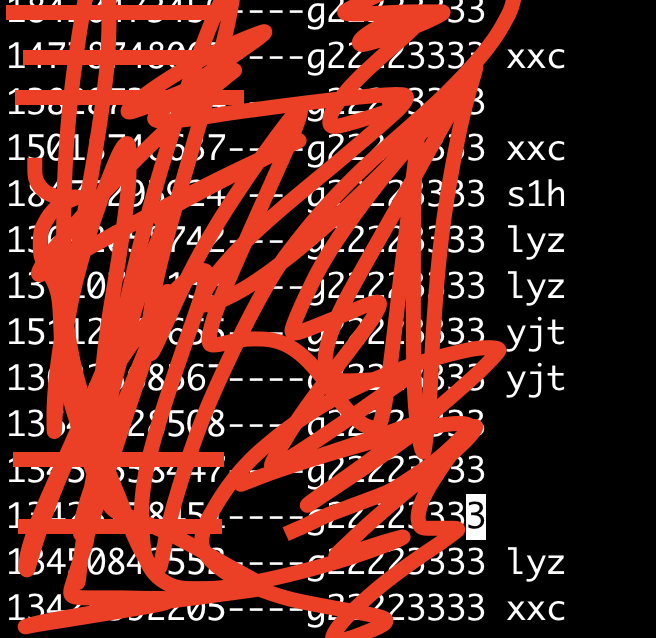

最近几天看青春有你3，pick 了一个弟弟（孙滢皓），为了给弟弟投票写了一个小 demo。

功能分析：records 文件中记录了今天投了的号，大概总数是 500 多条，文件内容如下所示，投票过程中将每一个已经被其他家粉丝抢投的号的缩写写在被投的后面，最后将今天已经投的号和被其他家抢投的号分成两个文件。



分成两个文件的目的是方便第二天直接将前一天被别家抢的号优先去投。

demo 的编写思路也很简单，首先按行读取文件中的每行内容，再根据每行的后缀进行判断，对每行内容进行处理后放到相应的文件中，如果后缀是别家弟弟的缩写，就直接去除缩写然后输出到 笋号文件中，否则直接输出到 op 文件中，账号风险的号就再也不能用了，直接删除。

```c++
//
//  main.cpp
//  datou_deal
//
//  Created by 赵琦 on 2021/4/25.
//  Copyright © 2021 inger. All rights reserved.
//
#include <iostream>
#include <fstream>//ifstream读文件，ofstream写文件，fstream读写文件
#include <string>//文本对象，储存读取的内容
using namespace std;

int startsWith(string s, string sub){
    return s.find(sub)==0?1:0;
}

int endsWith(string s,string sub){
    return s.rfind(sub)==(s.length()-sub.length())?1:0;
}

constexpr std::uint32_t hash_str_to_uint32(const char* data)
{
    std::uint32_t h(0);
    for (int i = 0; data && ('\0' != data[i]); i++)
        h = (h << 6) ^ (h >> 26) ^ data[i];
    return h;
}

int main(int argc, const char * argv[]) {
    // insert code here...
    int op = 0, sun = 0, hk = 0;
    ifstream infile("/Users/inger/Downloads/ins/gutou/502/502records");
    ofstream opfile;
    ofstream hkfile;
    ofstream sunfile;
    opfile.open("/Users/inger/Downloads/ins/gutou/502/502op");
    hkfile.open("/Users/inger/Downloads/ins/gutou/502/502yc");
    sunfile.open("/Users/inger/Downloads/ins/gutou/502/502sun");
    string line;
    string ends;
    if(infile) // 有该文件
    {
        while (getline (infile, line)) // line中不包括每行的换行符
        {
            ends = line.substr(line.size() - 3, 3);
            switch(hash_str_to_uint32(ends.c_str())){
                case hash_str_to_uint32(" lj"):
                case hash_str_to_uint32(" 17"):
                case hash_str_to_uint32(" ls"):
                    line.erase(line.size() - 3, 3);
                    sun++;
                    sunfile << line << endl;
                    break;
                case hash_str_to_uint32("lyz"):
                case hash_str_to_uint32("yjt"):
                case hash_str_to_uint32("lhw"):
                case hash_str_to_uint32("s1h"):
                case hash_str_to_uint32("dxx"):
                case hash_str_to_uint32("lgy"):
                case hash_str_to_uint32("dxc"):
                case hash_str_to_uint32("xxc"):
                case hash_str_to_uint32("tjz"):
                case hash_str_to_uint32("chs"):
                case hash_str_to_uint32("dty"):
                case hash_str_to_uint32("ljh"):
                case hash_str_to_uint32("xzw"):
                case hash_str_to_uint32("hdr"):
                case hash_str_to_uint32("yhm"):
                case hash_str_to_uint32("wnj"):
                    sun++;
                case hash_str_to_uint32("vip"):
                    line.erase(line.size() - 4, 4);
                    sunfile << line << endl;
                    break;
                case hash_str_to_uint32("hfx"):
                    line.erase(line.size() - 5, 5);
                    hk++;
                    hkfile << line << endl;
                    break;
                default:
                    op++;
                    opfile << line << endl;
                    break;
            }
        }
    }
    else // 没有该文件
    {
        cout <<"no such file" << endl;
    }
    opfile.close();
    hkfile.close();
    sunfile.close();
    cout << "5-2 固投打投情况(微博id: xxx)" << endl;
    cout << "op: " << op << endl  << "笋: " << sun << endl;
    cout << "vip: " << 2 << endl;
//    cout << "固投号数：" << op + sun + hk <<endl;
    cout << "有效票数：" << op + 4 << endl;
    system("pause");
    return 0;
}
```

QAQ 随便写写记录一下然后就删掉打投项目，释放内存了


