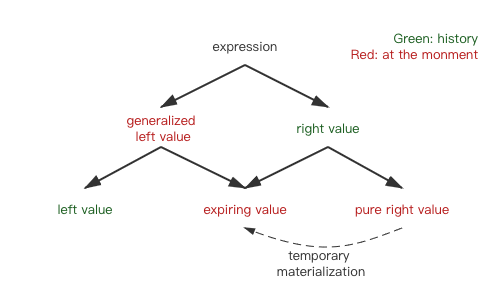

### 基本语言特性

#### 1. 结构化绑定（Structured Bindings）

将一个对象绑定到 **匿名对象**，结构化绑定时引入的新变量名实际上都指向这个匿名对象的成员/元素。

```c++
struct MyStruct {
  int i = 0;
  std::string s;
};
MyStruct ms{40, "uncle"};
auto [u, v] = ms; // u = 40, v = "uncle"
auto [u2, v2] {ms}; // 同上
auto [u3, v3] (ms); // 同上
u = 55;
ms.i = 90;
std::cout << u << " " << ms.i << std::endl; // 55 90

const auto& [u4, v4] = ms;
ms.i = 100; 
std::cout << u4 << " " << ms.i << std::endl; // 100 100

auto&& [u6, v6] = std::move(ms); 
std::cout << "ms.s: " << ms.s << std::endl; // uncle
std::string s = std::move(v6);
std::cout << "ms.s: " << ms.s << std::endl; // ms.s: 
std::cout << "v6:    " << v6 << std::endl; // v6: 
std::cout << "s:    " << s << std::endl; // uncle
```

结构化绑定适用于任何有`public`数据成员的结构体、 C风格数组和“类似元组(tuple-like)的对象。

- 对于所有非静态数据成员都是`public`的 **结构体和类** ， 你可以把每一个成员绑定到一个新的变量名上。
- 对于 **原生数组** ，你可以把数组的每一个元素都绑定到新的变量名上。
- 对于任何类型，你可以使用 **tuple-like API** 来绑定新的名称， 无论这套API是如何定义“元素”的。对于一个类型 *type* 这套API需要如下的组件：
  - `std::tuple_size<type>::value`要返回元素的数量。
  - `std::tuple_element<idx, type>::type` 要返回第`idx`个元素的类型。
  - 一个全局或成员函数`get<idx>()`要返回第`idx`个元素的值。

```c++
// until c++ 17
for (const auto& elem : mymap) {
	std::cout << elem.first << ": " << elem.second << '\n';
}
// since c++ 17
for (const auto& [key, val] : mymap) {
	std::cout << key << ": " << val << '\n';
}
```

#### 2. 带初始化的 if 和 switch 语句

if 和 switch 语句允许在条件表达式中添加一条初始化语句：

```c++
// s 初始化后在 if 语句中有效，包括 else 分支里。
if(status s = check(); s != status::success) {
  return s;
}
// example: 声明一个文件系统路径，根据类别进行处理
namespace fs = std::filesystem;
switch (fs::path p{name}; status(p).type()) {
  case fs::file_type::not_found:
    std::cout << p << " not found\n";
    break;
  case fs::file_type::directory:
    std::cout << p << ":\n";
    for (const auto& e : std::filesystem::directory_iterator{p}) {
      std::cout << "- " << e.path() << '\n';
    }
    break;
  default:
    std::cout << p << " exists\n";
		break; 
}
```

#### 3. 内联变量

c++17 之前不允许在类内初始化非常量静态成员，而且在类外初始化非常量静态成员如果被多个 cpp 文件同时包含会引起新的链接 Error.

```c++
// before c++ 17
class MyClass {
	static std::string msg{"OK"}; // 编译期ERROR ...
};

class MyClass {
  static std::string msg;
};
std::string MyClass::msg{"OK"}; // 如果被多个CPP文件包含会导致链接ERROR

// since c++ 17
class A {
public: 
  inline static int a = 100; // ok
};

inline A a; // 多个 cpp 文件包含也 ok，只要一个编译单元内没有重复的定义即可。

```

inline 变量保证 **即使定义所在的头文件被多个 CPP 文件包含，也只会有一个全局对象**。

constexpr static 隐含 inline: 

```c++
struct D {
  static constexpr int n = 5;
};

// constexpr int D::n; // c++ 14 必须添加该条声明语句，c++17 弃用
const int* p = &D::n; // c++14: Undefined symbols for architecture x86_64: "D::n", c++17 ok
```

#### 4. 聚合体扩展（Aggregate with base classes）

聚合体：**数组或者 C 风格的简单类**，简单类要求**没有用户定义的构造函数、没有私有或保护的非静态数据成员、没有虚函数**，在 C++17 之前，还要求没有继承。

```c++

struct Data {
  int i;
  double d;
};

struct MoreData : Data {
  bool flag;
  //MoreData (int i, double d, bool b) : Data{i, d}, flag{b} {} // c++14 需要额外添加 ctor
};

int main() {
  Data x{1, 0.1};
  MoreData y{2, 0.2, true}; // c++17 ok, c++ 14 error: no matching constructor for initialization of 'MoreData'
  
  MoreData z1{}; // all members initialize with value 0
  MoreData z2; // all members are undefined
  MoreData z3{{3}}; // {{3, 0}, false}
  MoreData z4{{}, true}; // {{0, 0}, true}
}

```


- 可以跳过一些值去初始化，被跳过的成员会进行默认初始化（基础类型初始化为 0、false 或 nullptr，类会默认构造）；
- 使用花括号和不使用花括号完全不同：
  - z1 的成员默认初始化为 0；
  - z2 的定义没有初始化任何成员，所有成员的值都是未定义的；
- 内部嵌套的初值列表将按照继承时基类声明的顺序传递给基类；

```c++

template<typename T>
struct D : std::string, std::complex<T>
{
  std::string data;
};

int main() {
  D<float> s{{"hello"}, {4.5, 4.6}, "world"};
  D<float> t{"hello", {4.5, 6.7}, "world"};
  std::cout << static_cast<std::string>(s) << s.data << std::endl;
  std::cout << static_cast<std::complex<float>>(t) << std::endl;
}

```

- c++ 17 引入 is_aggregate<> 测试一个类型是否为聚合体；

```c++
std::cout << std::is_aggregate<decltype(s)>::value; // 输出1(true)
std::cout << std::is_aggregate<decltype(s.data)>::value; // 输出0(false)
```

#### 5. 强制省略拷贝或传递未实例化的对象（Mandatory Copy Elision or Passing Unmaterialized Objects）

**C++ 值类型体系**： [视频: Back to Basics: understanding value categories](https://www.youtube.com/watch?v=XS2JddPq7GQ)

> - An lvalue is an expression referring to an object, and an objedct is a region of storage.
> - An rvalue is simply an expression that's not an lvalue.
>
> Conceptually, rvalue of class type do occupy data storage.  And conceptually, rvalues of build-in types don’t occupy data storage. However, the tempory object created is still an rvalue, but it occupies data storage. So there are two kinds of rvalues.
>
> - prvalue: pure right valu, which **do not** occupy data storage.
> - xvalue: expiring, which do occupy data storage.
> - The temporary object is created through a **temporary materialization conversion**. It converts a prvalue to into an xvalue.
>
> ```c++
> string s = "hello";
> string t = "world";
> s = s + ", " + t; // compiler: s = s + string(", ") + t, lvalue + rvalue + lvalue
> ```
>
> 

C++14 使用临时对象来初始化要求类中必须有隐式或显式的 copy or move ctor. C++ 17 用临时变量（prvalue）初始化对象时 copy elision 是强制性的。

```c++
class A {
  public:
    A(const A&) = delete;
    A(A&&) = delete;
};

void foo(A param) {}

A bar() {
  return A{};
}

int main() {
  foo(A{}); // 临时对象 A{} 初始化 param, c++14 error, c++17 ok
  A x = bar(); // 返回的临时对象初始化 x, c++14 error, c++17 ok
  foo(bar()); // 返回的临时对象初始化 param, c++14 error, c++17 ok
  return 0;
}
```

强制 copy elision 的作用：

1. 减少临时变量 copy 带来更好的性能；
2. 可以定义一个总是可以工作的工厂函数；
3. 对于移动构造函数被显式删除的类，也可以返回临时对象来初始化新的对象；

#### 6. lambda 表达式扩展

##### 6.1 `constexpr` lanmbda ，编译期 lambda

从 c++ 17 开始，lambda 表达式会尽可能的隐式声明未 constexpr. 

>  任何只使用有效的编译期上下文 (例如，只有字面量，没有静态变量，没有虚函数，没有 try/catch，没有 new/delete 的上下文)的 lambda 都可以被用于编译期。

```c++
auto squared = [](auto val) { // 隐式声明为 constexpr，编译期 lambda
  return val * val;
};

std::array<int, squared(5)> a; // c++ 14 error: non-type template argument is not a constant expression, c++17: std::array<int, 25>

auto squared2 = [](auto val) constexpr {
  static int tmp = 0; //c++17 error: static variable not permitted in a constexpr function
  return val * val;
};
```

一个隐式或显式的 constexpr lambda 的函数调用符也是 constexpr.

```c++
auto squared = [](auto val) {
  return val * val;
};
// 上述代码会转换为如下闭包类型
class CompilerSpecificName {
    public:
        ...
        template<typename T>
        constexpr auto operator() (T val) const {
            return val*val;
        }
};
```

以下两种不同定义：

```c++
auto squared1 = [](auto val) constexpr { // 编译期 lambda 调用，运行时初始化 squared1 
  return val * val;
};

constexpr auto squared2 = [](auto val) { // 编译期初始化 squared2
  return val * val;
};

std::array<int, squared1(5)> a; 
std::array<int, squared2(5)> b; 
```

如果静态初始化顺序很重要那么可能导致问题，可能会导致 `static initialization order fiasco`。

> 没整明白

##### 6.2 capturing *this

在非静态成员函数中，如果不捕获 this，不能在 lambda 函数内部访问任何类成员。

```c++
class C {
private:
  std::string name;
public:
  void foo() {
    auto l1 = [] { std::cout << name << '\n'; }; // error: 'this' cannot be implicitly captured in this context
    auto l2 = [] { std::cout << this->name << '\n'; };  // ERROR
  }
};
```

c++ 11 和 14 以值或引用的方式捕获 this 指针。当对象的生命周期结束，而 lambda 的生命周期还没有结束时，就会出现问题。比如在 lambda 中 开启一个新的线程来完成某些任务。c++ 14 提供的以拷贝方式捕获 this 指针的解决方案是 `[self = *this]{ self.f(); }` ，c++ 17 的更新是：`[*this]{ f(); }`，优化了写法。


### New core language features with global applicability

#### 1. made noexcept part of type system

以 `noexcept` 修饰的函数和没有`noexcept`修饰的函数是不同类型，会导致函数重载;

```c++
void nonthrowing_func() noexcept {} // or noexcept(true)
void throwing_func() noexcept(false) {}

void call_func_ptr(void (*fp)() noexcept) noexcept {
  fp();
}

template <typename T>
void call_func_ptr2(T) {}
template <>
void call_func_ptr2(void (*fp)() noexcept) {}

int main() {
  call_func_ptr(nonthrowing_func); // fp()
  // call_func_ptr(throwing_func); // error, no known conversion from 'void () noexcept(false)' to 'void (*)() noexcept' for 1st argument

  call_func_ptr2(nonthrowing_func); // call_func_ptr2 fp,
  call_func_ptr2(throwing_func); // c++17 call_func_ptr2 T, c++14 error: target exception specification is not superset of source
  return 0;
}
```

> Before C++ 17 ：
>
> The noexcept-specification is not a part of the function type (just like [dynamic exception specification](https://en.cppreference.com/w/cpp/language/except_spec)) and can only appear as a part of a [lambda declarator](https://en.cppreference.com/w/cpp/language/lambda) or a top-level [function declarator](https://en.cppreference.com/w/cpp/language/function) when declaring functions, variables, non-static data members of type function, pointer to function, reference to function, or pointer to member function, and also when declaring a parameter or a return type in one of those declarations that in turn happens to be a pointer or reference to function. It cannot appear in a [typedef](https://en.cppreference.com/w/cpp/language/typedef) or [type alias](https://en.cppreference.com/w/cpp/language/type_alias) declaration.
>
> ```
> void f() noexcept; // the function f() does not throw
> void (*fp)() noexcept(false); // fp points to a function that may throw
> void g(void pfa() noexcept);  // g takes a pointer to function that doesn't throw
> // typedef int (*pf)() noexcept; // error
> ```


### 移除或弃用的特性

#### Removed 

- auto_ptr, random_shuffle, `<functional>` 中过时的部分: cpp11使用 unique_ptr 替代，cpp17 移除；
- `??!` 
- register: 依然是关键字，但不具有任何语义；
- 不再支持 bool 类型的 ++ 操作：bool++, ++bool;
- iostream 中被弃用的一些别名

#### Depracated

- 弃用静态 constexpr 类成员的重新声明；


-------
References:

- [Changes between C++14 and C++17 DIS](http://www.open-std.org/JTC1/SC22/WG21/docs/papers/2017/p0636r1.html)
- [std::auto_ptr](https://www.cplusplus.com/reference/memory/auto_ptr/)
- [noexcept](https://zh-blog.logan.tw/2020/07/27/cxx-17-changes-to-exception-specification/)
- [c++17 完全指南](https://github.com/MeouSker77/Cpp17)

