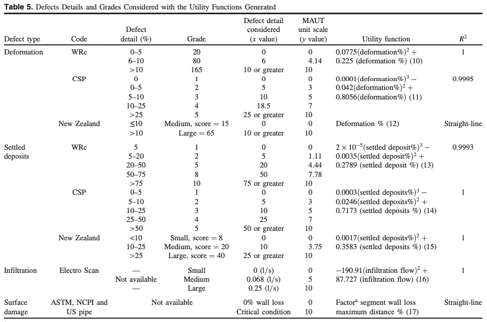

## 论文：Multiattribute Utility Theory Deployment in Sewer Defects Assessment

### Abstract

评估下水道管道状况是规划修复和维护工作的主要过程。闭路电视（CCTV）方法是广泛采用的记录管道内部状况的方法，然后由从业人员进行解释。本文提出了使用多属性效用理论 (MAUT) 的下水道管道状况评估框架。状态评估模型利用 MAUT 为四种下水道管道缺陷生成多个效用函数：变形、沉淀物、渗透和表面损坏。提出了一种建议的表面损伤评估方法来评估三种不同材料的表面损伤缺陷：钢筋混凝土、玻璃化粘土和球墨铸铁。基于所研究缺陷的相对重要性权重计算聚合条件指数，并使用几种舍入类型进行测试。舍入类型产生最佳结果，并将值与 Concordia 进行比较 下水道协议 (CSP) 建议的方法导致两种方法之间的平均差异为 3.33%；平均绝对误差 (MAE) 为 0.33。然后进行敏感性分析以检查相对重要性权重的变化对整体指数的影响。提议的方法旨在为资产管理者提供有关下水道管道中存在的一些下水道缺陷的严重程度的信息。此外，它还通过建议下水道管道的现有状况来加强他们的修复和维护计划 。

### 正文

多属性效用理论(MultiAttribute utility theory)是Ananda和Herath 2005年提出的用于评估对象、产品和服务的评估方式，旨在处理多个目标之间的权衡问题。例如，n 辆汽车中的选择可以取决于每辆汽车的马力值、最大速度和生产年份等因素。

MATU 中整体评估由以下整体价值函数描述：
$$
U_j = \sum_{i=1}^{2}w_{ij}v_{ij}\\
\sum_{i=1}^{n}w_{ij}=1
$$

- $U_j$: j 类别下的所有子缺陷类型的所有缺陷的效用值；
- $j$ : 缺陷大类，分为结构型和功能型两种；
- $w_{ij}$: 第 i 个目标在 j 类别下的权重值；
- $v_{ij}$: 第 i 个目标在 j 类别下的评估值；

所以管道状况等级由下式确定：
$$
CI_{pipeline} = \sum_{j=1}^2 w_jU_j
$$

- $CI_{pipeline}$: condition index, 也就是管道状况等级，1，2，3，4，5；
- $w_j$： j 型缺陷对管道影响的相对权重值，有结构型和功能型两种；

Daher 2015年利用 ANP 确定了下水道缺陷组、缺陷和子缺陷的权重值。

在本文中，结构型缺陷包括变形和表面损伤两种，功能型缺陷包括沉积物和渗漏。为每种缺陷设计了效用函数。首先，确定每个缺陷的严重程度范围（指定最大和最小值）。依据 WRs 协议（2004）、新西兰排水管道协议（2006）和Concordia 排水管道协议（CSP 2015），得到了变形和沉积物缺陷的最大最小数值。然而，这些协议都缺少渗漏及表面损伤的数值评估，仅有语言描述评估方式。

1. 设置评估结果的最大值和最小值后，指定采用的衡量范围。例如，在本文中采用从 0 到 10 的测量尺度，将其分配到 1 - 5 等级。
2. 使用最高决定系数$R^2$的回归技术开发效用函数；

效用函数的计算值为 1-10，依据下表的对应关系将其离散化为缺陷等级：

| 缺陷等级 | 效用函数计算值 | 逻辑描述  |
| -------- | -------------- | --------- |
| 1        | 0-1            | excellent |
| 2        | 1-3            | good      |
| 3        | 3-6            | fair      |
| 4        | 6-8            | poor      |
| 5        | 8-10           | cirtical  |

由于表面损伤同时受管道材料影响，需要额外的分析来定义最大值最小值，作者研究了三种不同下水道管道材料：钢筋混凝土、球墨铸铁和陶土管道。

下表展示了四种缺陷对应的效用函数。对于变形和沉积缺陷，依据三种不同的排水管道检测协议WRc, CSP, New Zealand 生成了不同的效用函数，将协议中的数值映射到1-10的缺陷等级中。渗漏缺陷的效用函数依据电扫描评估标准生成效用函数，通过判断渗漏的流量得出缺陷等级；表面损伤通过壁损值计算缺陷等级，壁损值小于最小范围的记为 0，壁损值大于最大允许壁损值的记为 10。

**基于缺陷的聚合条件值**：效用函数为每个缺陷计算一个缺陷分值，表示该缺陷的严重程度。一个管道中所有缺陷通过加权计算，得出整个管道的运行状况。Daher计算的相对重要性权重如下表所示：

- 结构型：0.62
  - 表面损伤：0.39
  - 变形：0.61
- 功能型：0.38
  - 渗漏：0.63
  - 沉积：0.37

例如，一个渗漏缺陷和沉积缺陷的缺陷分值分别是3和5，那么功能型缺陷的聚合分值为$S_{OP}=0.63\times3 + 0.37\times5=3.74$，管道总体状况 $CI_{pipeline} = 0.38 \times S_{OP} + 0.62\times S_{ST}$。

#### 实验验证

数据来源：卡塔尔（Ashghal）的 12 个 CCTV 报告（基于 EN13508的编码方案和基于DWA-M 149-3的报告） 和加拿大拉瓦尔市、蒙特利尔市的 5 个 CCTV报告（PVCP编码系统方案）。

实验数据：CCTV 报告；报告中包含带有缺陷及其严重程度的图像。每一份报告中至少含有四种缺陷之一。

验证指标：平均绝对误差 MAE，验证效用函数计算值与真实值之间的误差。其中，效用函数的计算结果可能是小数，分别采用三种舍入类型（四舍五入、向上舍入、向下舍入）。

