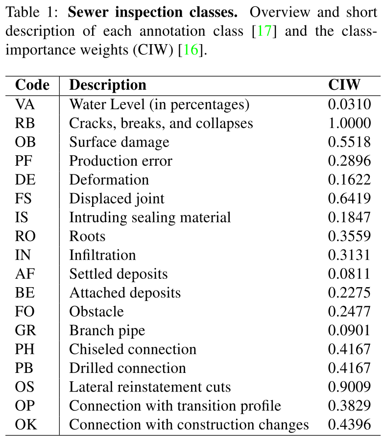

## 数据集：Sewer-ML

- 数据集大小：303.8G

- [benchmark repo](https://bitbucket.org/aauvap/sewer-ml/src/master/)

- [Pretrained Model](https://sciencedata.dk/shared/sewerml_cvpr2021_models)

  ### Abstract

  也许令人惊讶，排水管网基础建设是现代社会最昂贵的基础设施之一。人工检查下水管道以确定管道是否有缺陷。但是，此过程受到合格检查员数量和检查管道所需时间的限制。因此，检测过程自动化吸引了很多学者的研究。到目前为止，与其他领域的成功相比，计算机视觉方法在下水道缺陷分类方面的成功受到限制，这主要是由于缺乏公共数据集。为此，在这项工作中，我们提出了一个大型新颖且公开可用的多标签分类数据集，用于基于图像的下水道缺陷分类，称为 Sewer-ML。

  Sewer-ML 数据集包含 130 万张图像，这些图像由来自三个不同公用事业公司的专业下水道检查员在九年内进行了注释。连同数据集，我们还提出了一个基准算法和一个评估性能的新指标。基准算法是评估 12 种最先进算法的结果，其中 6 种来自下水道缺陷分类域，6 种来自多标签分类域，并结合了性能最佳的算法。新指标是类别重要性加权  分数 ，反映每个类别的经济影响，与正常管道  分数 一起使用。基准算法实现了 55.11% 的  分数和 90.94% 的  分数，为 Sewer-ML 数据集留下了充足的改进空间。

  > CIW: class-importance wegihts, 类别重要性权值

  ### 正文

  

  缺陷类别：

  - VA: 水位
  - RB: 破裂（包括裂纹、破裂、坍塌）
  - OB: 表面损伤（类似腐蚀）
  - PF: 生产错误（管道生产出来时就存在的缺陷）
  - DE: 变形
  - FS: 错口
  - IS: 异物穿入
  - RO: 树根
  - IN：渗漏
  - AF：沉积物
  - BE: 结垢
  - FO: 障碍物
  - GR: 支管暗接
  - PH：轮廓分明的连接，看起来也像是支管
  - PB: 钻孔
  - OS: 横向破洞
  - OP: 与过渡剖面的连接
  - OK: 与建筑物变化处连接

  自动化管道缺陷检测近三年来吸引了大量的关注，然而目前的主要局限表现在以下几个方面：1. 没有公开的基准数据集，2. 很少，几乎没有开源代码，3.没有公用的指标或评估协议。从而导致研究人员往往在自己的数据集上依据各个国家自己的检测与评估规程设计模型，也自然无法与其他模型比较算法的性能。

  本文的贡献：

  1. 公开的多标签缺陷检测数据集，包含130万张标注的缺陷图像；
  2. 在新数据集下，公开了各个最新方法的性能对比数据；
  3. 一种新的类别重要性加权的 F2 指标；
  4. 一种结合下水道缺陷和多标签分类领域知识的基准算法。

  