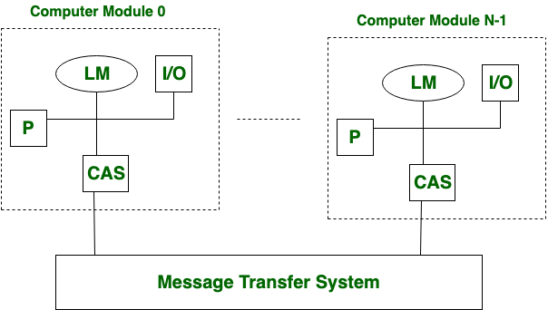
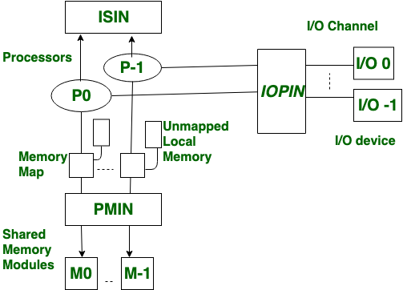

### 0. 相关定义

多处理器（Multiprocessor）系统：多处理器是具有两个或多个中央处理单元 (CPU) 的计算机系统，它们共享对公共 RAM 的完全访问权限。

分布式系统（Distributed System）：分布式系统是**物理上独立**的、**可能是异构**的**计算机系统的集合**，这些计算机系统通过**网络**（LAN 或 WAN）为用户提供对系统维护的各种资源的访问。

并行处理系统（Parallel Computer System）：指同时执行多个任务或多条指令或同时对多个数据项进行处理的计算机系统。

###1. 松耦合多处理器系统

松耦合的多处理器系统，有分布式内存而不是共享内存，模块间通过 MTS（消息传输系统）网络连接。

### 2. 紧耦合多处理器系统

紧耦合多处理器系统有共享内存，模块间通过处理器-内存间连接 PMIN（processor-memory interconnection network）、I/O-处理器间连接 IOPIN（I/O-processor interconnection network） 和中断信号 ISIN（interrupt-signal interconnection network）连接。

### 3. 二者的不同

| 松耦合                                                       | 紧耦合                                                       |
| ------------------------------------------------------------ | ------------------------------------------------------------ |
| 分布式内存                                                   | 共享内存                                                     |
| 数据传输速率低                                               | 数据传输速率高                                               |
| 费用低                                                       | 费用高                                                       |
| 模块间通过消息传输系统MTS通信                                | PMIN, IOPIN, ISIN                                            |
| 不存在内存冲突                                               | 存在内存冲突                                                 |
| 任务间的交互程度低                                           | 任务间的交互程度高                                           |
| 处理器和 I/O 设备之间存在直接连接                            | IOPIN 处理 I/O设备和处理器之间的连接                         |
| 松耦合多处理器的应用在分布式计算系统（distributed computing systems） | 紧耦合多处理器的应用在并行处理系统（parallel processing systems） |

