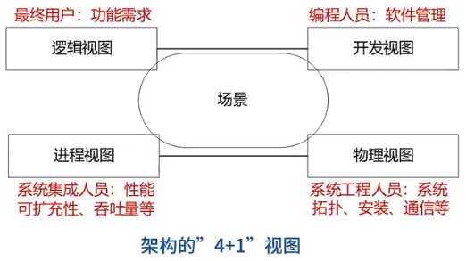
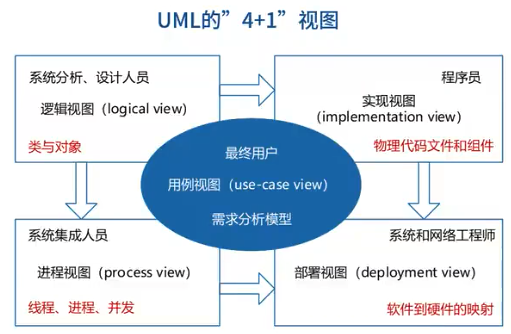
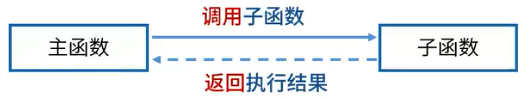
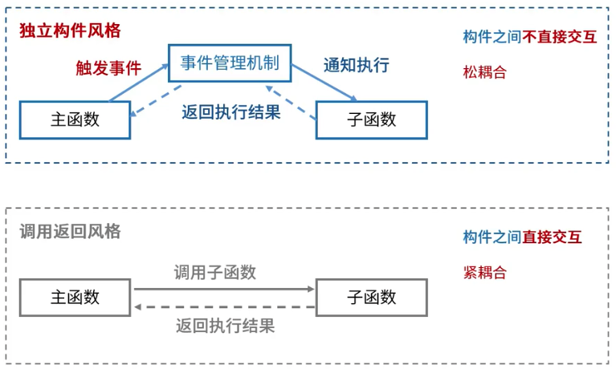
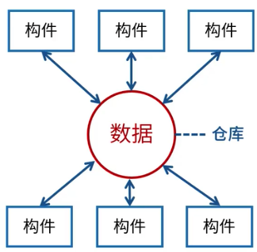
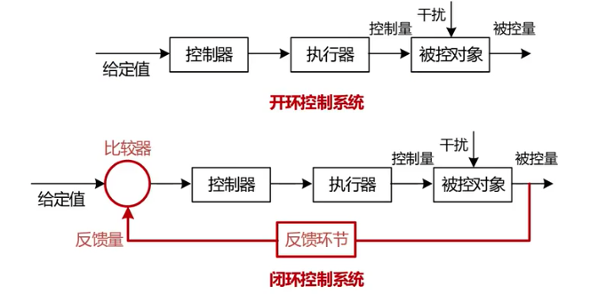

[TOC]

### 软件架构的概念

架构的本质：

1. 为软件系统提供了一个结构、行为和属性的高级抽象；
2. 是特定应用领域的惯用模式，架构定义一个词汇表和一组约束；

架构的作用：

1. 是项目干系人进行交流的手段；
2. 可传递和可复用的模型，通过研究软件架构可能预测软件的质量；
3. 使推理和控制的更改更加简单，有助于循序渐进的原型设计，可以作为培训的基础。

软件架构 = 软件体系结构，架构设计就是需求分配，即将满足需求的职责分配到组件上。

### 4+1 视图

架构发展历程：

1. 无架构阶段：汇编语言；
2. 萌芽阶段：程序结构设计；
3. 初级阶段：统一建模语言 UML；
4. 高级阶段：4+1 视图；

何为视角与视图？从不同的视角来检查，所以会有不同的视图。

架构的 4 + 1 视图中，1表示场景，4分别指的是逻辑视图、开发视图、进程视图（过程视图）、物理视图。逻辑视图指最终用户的功能需求，开发视图指编程人员的软件开发，进程视图为系统集成人员关心的性能、可扩充性、吞吐量等，物理视图指系统工程人员负责的系统拓扑、安装、通信等。

### 软件架构风格

重点五大架构风格，其中每种风格又分为多种子风格。

- 数据流风格：以数据处理为导向
  - 批处理
  - 管道-过滤器
- 调用/返回风格
  - 主程序/子程序
  - 面向对象
  - 层次结构
- 独立构件风格：强调每个构件尽可能独立，避免紧耦合
  - 进程通信
  - 事件驱动系统（隐式调用）
- 虚拟机风格：构造虚拟机去完成内容的解读
  - 解释器
  - 规则系统
- 仓库风格
  - 数据库系统
  - 黑板系统
  - 超文本系统

在应用过程中，往往是多种架构风格同时使用。在写论文时，不可以只用一种架构风格。了解每种架构风格，应用时扬长避短，综合应用。

#### 数据流风格

分步处理数据，数据驱动，前一步的处理结果是后一步的输入内容。

优点：

1. 数据和处理过程独立，松耦合，复合高内聚、低耦合；
2. 具有良好的重用性 / 可维护性；
3. 可扩展性，适配标准接口；
4. 隐蔽性良好；
5. 支持并行

缺点：

1. 交互性较差：数据输入后一步步进行处理，不需要人工干预，所以对人操作的支持性较差；
2. 复杂性较高；
3. 性能较差：每个过滤器都需要解析与合成数据；

典型实例：传统编译器、网络报文处理等。

子风格：

- 批处理：**大量整体数据**批量处理、无需用户交互；
- 管道-过滤器：**流式数据**、弱用户交互；

#### 调用/返回风格

- 主程序/子程序：面向过程
- 面向对象：对象的方法调用
- 层次结构：层与层之间的方法调用；各个层次的组建形成不同功能级别的虚拟机；多层相互协同工作，而且实现透明。例如 ISO 七层模型。

优点：

1. 良好的重用性，只要接口不变可用在其他处；
2. 可维护性好
3. 可扩展性好，支持递增设计；

缺点：

1. 并不是每个系统都方便分层；
2. 很难确定合适的、正确的层次抽象方法；层次多影响效率，层次少可能导致逻辑结构不清楚、内容混杂；
3. 不同层次之间的耦合度高的系统很难实现；

#### 独立构件风格

基本思想：构件之间不直接交互，主函数触发事件，通过事件管理机制，通知执行子函数。

优点：

1. 松耦合；
2. 良好的重用性/可修改性/可扩展性；

缺点：

1. 构件放弃了对系统计算的控制。不能确定构件是否响应所触发的事件，也不能保证这些过程调用的顺序。
2. 数据交换的问题。
3. 过程的语义依赖于被触发事件的上下文约束，关于正确性的推理就存在问题。

例如：事件调用、按钮响应；

#### 虚拟机风格

例如：Java 虚拟机。C 语言代码通过编译生成机器语言代码，不同操作系统对机器语言的解释方式可能不同。Java 语言代码通过编译成**字节码文件**在 Java 虚拟机上执行，不同的操作系统拥有不同的 Java 虚拟机，通过 Java 虚拟机实现跨平台。

子风格：

- 解释器：适用于需要 “自定义规则” 的场合；
- 规则系统：在解释器的基础上增加经验规则，适用于专家系统；

优点：可以灵活应对自定义场景；

缺点：复杂度较高

#### 仓库风格

仓库：用来存储数据的中央部件；

子风格：

- 数据库系统：各种操作围绕中心数据进行处理；
- 黑板系统：语音识别、知识推理；黑板作为中央数据源，在数据库风格基础上增加了触发知识源的机制；
- 超文本系统

应用：操作系统的注册表、剪贴板、

#### 其他风格

**闭环控制风格（过程控制）**

适用于嵌入式系统，用于解决简单闭环控制问题。

经典应用：空调温控，定速巡航。

**C2风格**：构件和连接件。

