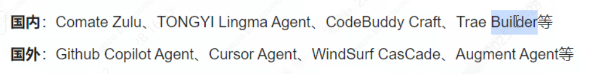
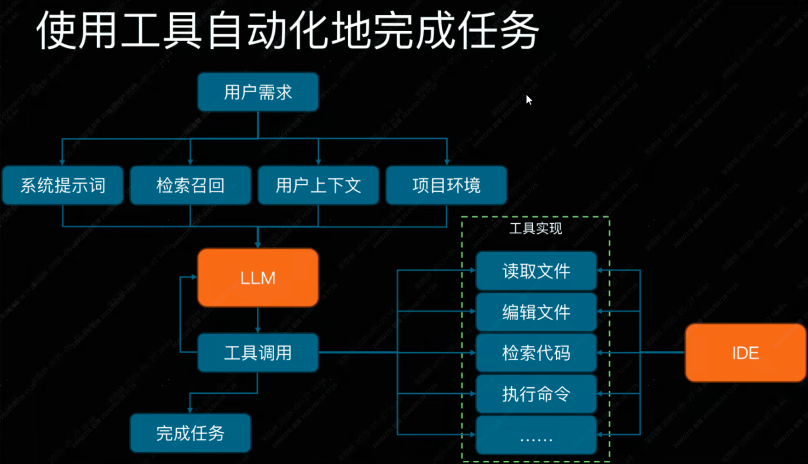

### 1. AI 编程工具的发展

- 低谷：23年ChatGPT发布以前，少数人知晓。
- 飞速：国内外各种工具，插件等等，进入大众视野。
- 狂热阶段：大模型能力、AI智能体、MCP协议的使用，AI编程工具进化为自动编程智能体，被一众大厂追捧。

> MCP(Model Compute Protocol) 是一种用于**分布式机器学习**或**联邦学习**（Federated Learning）的通信协议，旨在协调多个设备或节点之间的模型训练和参数交换。它的核心目标是高效、安全地实现跨设备或跨组织的协作学习，同时保护数据隐私。

### 2. AI 编程工具的现状

代码补全 -> 自主阅读工程 -> 规划实现路径 -> 调用多种工具 -> 最终实现研发任务

### 3. Manus 介绍

中国团队 monica.im 研发的通用型 AI 智能体，目标是独立规划、执行复杂任务并直接交付完整成果，而非仅提供建议或分布指导。

- 自动执行、闭环任务处理：多智能体协作架构
- 云端异步运行
- 跨领域工具集
- 自主学习与用户偏好适应
- 开源生态

#### 4. 研发领域 Manus 有哪些

### 5. 研发领域Manus应用场景

- 项目工程解读
- 开发环境搭建
- 文件/项目重构
- 需求实现
- 程序编译运行
- Code Review
- ...
