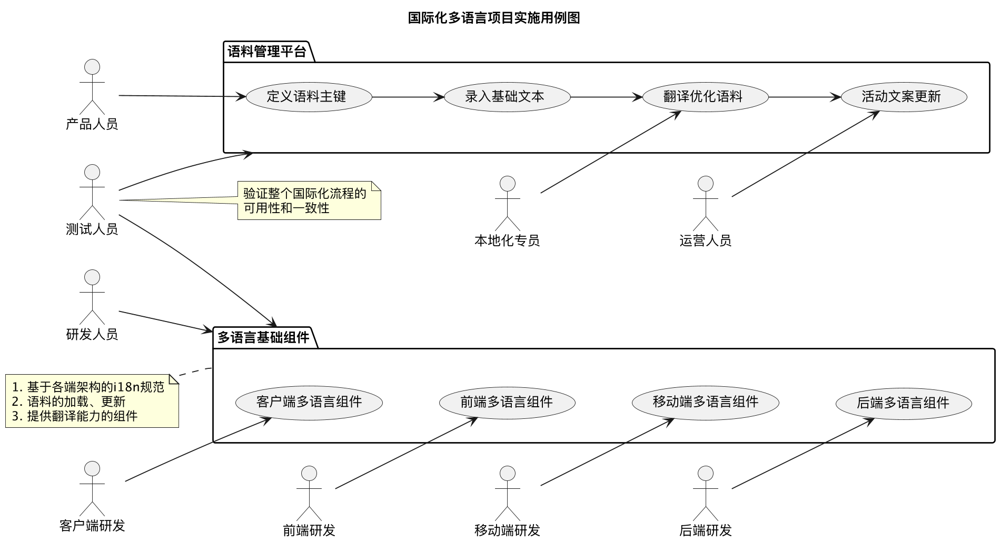
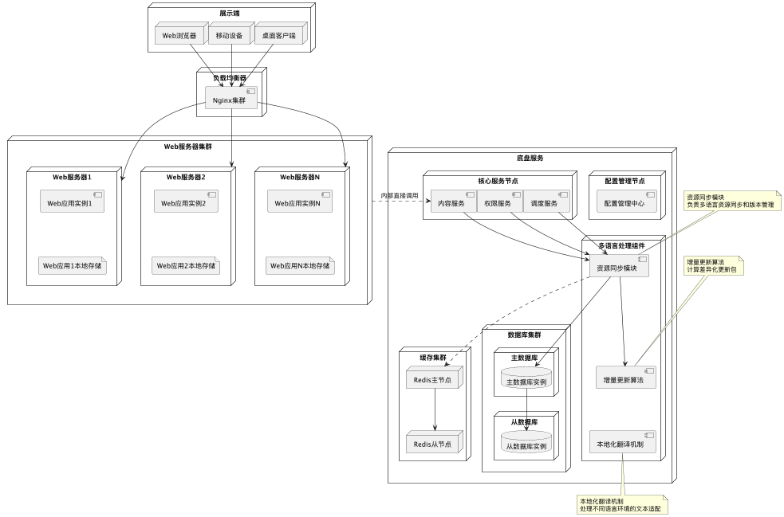
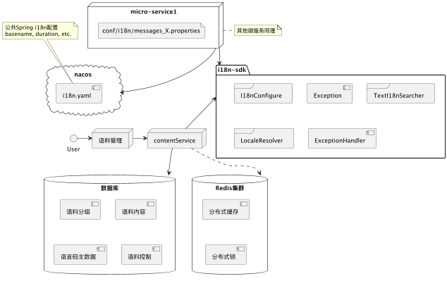
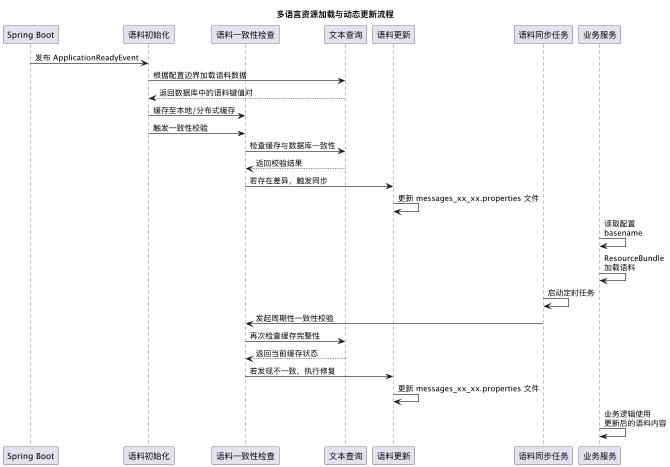

### 1. 背景与目标

在全球化浪潮的推动下，软件应用的国际化已成为企业能否在全球市场取得成功的关键因素之一。一个支持多语言的系统能够跨越语言障碍，吸引来自不同地区的用户，显著提升用户体验和市场竞争力。

现代大型应用系统，往往面向多元化的语言环境用户，整体国际化方案的设计复杂度随之大幅提升。系统设计时不仅需要处理海量的多语言文本资源，还需应对不同语言在语法结构、表达习惯、文化内涵等方面的差异。更为关键的是，随着业务的持续拓展，系统需要不断支持新的语言，如何实现横向扩展以适配新增语言，成为系统设计中亟待解决的重要问题。

传统的多语言系统在更新语言资源或新增语言时，往往需要重启应用，这不仅会中断用户服务，影响用户体验，还会增加系统维护的成本和风险。在集团某大型项目的研发过程中，我们探索了一种轻量化、可配置的、产研协同、动态加载的多语言项目实现方式，实现了所有语料的动态管理和实时加载，并且支持简单便捷的横向扩展方式。

### 2. 系统架构设计

为解决上述核心问题 —— 即大型应用在全球化进程中面临的多语言资源管理繁琐、新增语言扩展成本高、传统更新模式中断服务等痛点，本章将深入剖析系统架构的整体设计思路。通过搭建多角色高效协作的框架、制定覆盖项目全生命周期的分阶段适配策略，以及研发贯穿前后端的多语言文本热加载组件，形成一套能支撑动态管理、实时加载语料且便于横向扩展的解决方案，为后续服务端与展示端的具体实现提供清晰的架构指引。

#### 2.1 多角色协作框架

在项目实施过程中，不同角色对系统多语言的关注点并不相同，研发关注技术实现细节，而产品侧重点在系统国际化整体的易用性、语料的友好性。以前后端分离的项目架构为例，前端更关注界面上的标签、菜单、交互过程中的提示语等，而后端除了基本的应用程序逻辑校验提示，更多是数据的动态描述。

下图展示了国际化多语言项目实施过程中，不同角色的协作框架，涉及到不同阶段的不同角色。其中，语料管理平台是提供给项目团队成员的关键展示界面，通过分组和主键的定义，实现模块语料隔离和持久化数据管理。多语言基础组件是研发团队实现系统国际化的决定性因素。首先，各端需要依据项目实现的基础架构建立多语言规范，例如，前端的 Vue-i18n，Java 或 Kotlin 项目的 ResousrceBundle 等。其次，必须提供通用的语料加载、更新能力，以便于业务模块快捷获取语料主键或语料内容。最后，要基于用户在业务系统的上下文，结合本地标识信息，将其转化为正确的系统内资源，通俗讲看起来向进行了自动翻译。



#### 2.2 分阶段适配策略

分阶段来看，多语言内容的适配在项目不同生命周期的侧重点存在差异。项目开发阶段，多语言文本的具体内容，开发过程中无需过多关注。项目测试阶段，应全面覆盖场景清单，验证不同环境语言文本的正确性 。项目维护阶段，系统功能已经基本完善落地，能通过语料的唯一标识，找到文本内容随时可以动态调整。

**开发阶段**：**轻量接入，聚焦标识**

多语言系统在开发阶段，核心目标是降低研发接入成本，无需关注具体不同语言环境的内容。研发只需按照《标识规范》创建并引用标识，无需硬编码任何语言的文本。通过基础组件实现语料的本地化翻译工作，例如，Spring 项目代码中通过占位符替换 `${"NotBlank"}` 的方式，实现文本匹配 `NotBlank=不能为空`。

**测试阶段**：**全量校验，场景覆盖**

在测试阶段，需要前置进行语言切换和语料热加载测试，确保多语言基础能力是可用的。此外，各模块必须格外关注系统在不同语言环境下的正确性，可能会出现不同语言（尤其是英文、泰文）长度不一致，导致界面错位；文本翻译不准确、有歧义；数据多语言描述缺失导致的异常现象。

**维护阶段**：**动态调整，精准迭代**

系统上线后，在语料管理平台针对文本内容进行灵活调整。维护人员可通过标识搜索、按语言筛选、按业务域分组等方式定位目标文本，支持在线维护。例如发现 “es_ES”（西班牙语）中 “加入购物车” 翻译过长导致按钮换行，可直接修改文本为更简短的表达，点击 “发布” 后，系统通过热加载在2秒内完成全量系统文本更新。并且支持 “批量操作”，如针对新开通的 “阿拉伯语” 市场，可一键导出所有标识的中文文本，供翻译团队批量翻译后再一键导入，实现新语言的快速上线。

#### 2.3 多语言文本热加载组件

多语言文本热加载组件是实现动态调整的关键能力，贯穿前后端架构，包含资源同步模块、增量更新算法和本地化翻译机制。

- 资源同步模块：通过前后端实时通信和配置中心推送，确保语料变更在 1 秒内全链路同步，维持资源版本一致。
- 增量更新算法：仅传输修改或新增的文本，将大规模语料更新耗时压缩至 200 毫秒内，大幅优化性能。
- 本地化翻译机制：封装便捷的工具方法，根据用户语言环境返回对应文本，缺失时自动降级并标记补充需求，支持动态参数替换。

以分布式微服务架构为例，将通用的多语言热加载组件封装在底层实现，业务服务直接引用SDK，结合 nacos 配置管理，实现服务的动态文本关联，将语料同步至本地文件存储；同时，在SDK中封装基础 i18n 本地化的翻译能力，从而高效读取语料，完成语言环境解析和文本内容转换功能。



通过多语言组件封装的基础功能，业务团队无需关注底层实现，只需调用简单接口即可享受动态多语言能力，大幅降低了集成成本。


### 3. 服务端多语言方案

基于 Spring 生态的服务端多语言能力，主要依赖于 Java 国际化标准机制（如 `Locale`、`ResourceBundle`）和 Spring 框架提供的 `MessageSource` 接口。通过合理的设计与集成，可以在服务端实现多语言数据的动态展示、文本的动态加载和更新，以及与前端的语料统一管理。

服务端多语言需要关注的核心问题：

1. 数据动态描述：系统内所有的描述性信息，均在实体表的文本表中持久化保存相应多语言。在系统运行时动态录入的数据，在设计之初就要针对实体建立相应的文本表，并实现相应的维护逻辑。
2. 业务逻辑关联：将状态码、业务校验逻辑等与多语言文本建立映射关系，需前置将所有的语料 Key 硬编码在程序中，测试环节充分测试，确保系统在处理业务逻辑时能正确展示。
3. 底层框架语料扩展：许多依赖包往往内置基本的国际化语料，例如 hibernate validator, xxl-job 等常用框架，当系统需要用到底层框架提供的能力时，还需解决框架语料的兼容性问题，并进行定制化处理。

#### 3.1 语言码元数据规范

语言码元数据规范通常遵循的是 IETF（互联网工程任务组）发布的 BCP 47（Best Current Practice 47），它定义了标签来标识语言、地区以及书写系统，如 `zh_CN`、`en_US`、`es_ES`。

在现代 Web 项目中，语言码元数据规范化的应用非常普遍，尤其是在多语言支持方面：

- **HTTP 协议** 中，客户端可以通过 `Accept-Language` 请求头向服务器发送其首选语言列表，服务器则可以根据这个信息返回适当的语言版本内容。
- 在 **Web 开发框架** 中，如 Spring Boot，开发者可以利用 `LocaleResolver` 来解析用户的语言偏好，并通过 `MessageSource` 获取相应的本地化消息。
- 多数现代 CMS（内容管理系统）、电商平台和国际化应用程序都会采用 BCP 47 标准来管理和传递多语言内容，确保在全球范围内的一致性和准确性。

将语言码元数据唯一持久化维护在系统内，保障语言标识在系统内的统一性与可扩展性。

#### 3.2 核心组件设计

下图描述了一个支持动态配置的多语言微服务系统。在公共 i18n SDK 组件中，解决多语言环境下文本数据的实时更新问题。通过集中式配置管理，结合远程RPC调用、分布式缓存、本地 prop 文件，确保语料内容在各微服务节点间的动态同步。同时，提供本地化上下文解析、资源热加载等核心能力，构建出具备高弹性的国际化业务支撑体系。



**配置中心**：作为系统全局配置管理中枢，存储公共Spring i18n配置文件（i18n.yaml），包含basename、duration等基础参数。

**服务架构**：

- **语料管理服务**：提供语料管理界面，作为用户操作入口，承担语料创建、修改、审核等管理功能。
- **业务微服务（MicroService1）**：典型业务服务实例，包含本地化配置文件（messages_X.properties），支持多语言资源加载。系统设计支持横向扩展多个同类微服务实例。
- **内容服务（ContentService）**：作为基础服务组件，提供语料内容处理能力，向上用户支撑语料维护操作，向下对接数据存储层，并暴露服务间语料翻译接口。

**国际化SDK（i18n-sdk）**：

- **I18n配置模块**：封装国际化基础配置管理功能，包括资源加载策略、缓存机制等核心配置。
- **本地化解析器（LocaleResolver）**：实现语言环境动态解析，支持多语言切换和区域适配功能。
- **文本搜索服务（TextI18nSearcher）**：提供语料检索接口，采用Feign声明式客户端实现服务间调用。
- **异常处理组件**：包含Exception基类和ExceptionHandler统一处理器，实现业务系统已知异常的国际化消息封装。

**数据存储**：存储核心数据，语料分组用户划分模块边界，语料内容存储实际不同语言文本内容，语言码主数据表集中管理系统内支持的语言，语料控制状态、类型等辅助数据。结合Redis集群，实现热点数据缓存和语料更新操作的原子性保障。

##### 3.2.1 `MessageSource` 语料解析 

Spring 提供了非常强大的 i18n 能力，`MessageSource` 接口用于支持国际化消息的解析，核心实现类为 `ReloadableResourceBundleMessageSource`，支持动态加载语料。

示例配置如下：

```java
@Bean
public MessageSource messageSource() {
    ReloadableResourceBundleMessageSource messageSource = new ReloadableResourceBundleMessageSource();
    messageSource.setBasename("classpath:messages");
    messageSource.setDefaultEncoding("UTF-8");
  	// 设置缓存时间，实现热加载
    messageSource.setCacheSeconds(5);
    return messageSource;
}
```

##### 3.2.2 本地化解析 `LocaleResolver`

Spring 提供了多种 `LocaleResolver` 实现来解析用户请求的语言环境，常见有：

- `AcceptHeaderLocaleResolver`：基于 HTTP 请求头中的 `Accept-Language`；
- `CookieLocaleResolver`：基于 Cookie；
- `SessionLocaleResolver`：基于 Session；
- 自定义解析器：可结合用户配置或 URL 参数解析语言环境。

示例配置：

```java
@Bean
public LocaleResolver localeResolver() {
    SessionLocaleResolver slr = new SessionLocaleResolver();
    slr.setDefaultLocale(Locale.SIMPLIFIED_CHINESE);
    return slr;
}
```

##### 3.2.3 语料同步

如下的时序图描述了基于 Spring Boot 框架的微服务系统在启动及运行阶段，多语言资源（Message Resource）的加载、缓存、一致性校验与动态更新的完整流程。系统启动阶段，监听 Spring Boot 容器发布 `ApplicationReadyEvent` 事件，触发语料初始化机制，依据配置边界，从数据库中加载获取服务关联的所有多语言文本，并同步至分布式缓存或本地缓存中，实现运行时快速访问。

随后，为了维护语料消息的一致性，对比远程同步到的数据和本地文本。若发现差异， 将最新的语料内容写入本地资源文件（如 `messages_zh_CN.properties`），确保基于 `ResourceBundle` 的传统加载机制仍可正确读取。在系统正常运行期间，业务服务将预设周期启动定时任务，周期性地执行语料一致性检查，实现对语料变更的动态响应与自动同步。一旦检测到不一致，系统将自动执行上述同步流程，更新本地 `.properties` 文件。

业务服务模块通过 Spring 的 `MessageSource` 接口读取配置项 `spring.messages.basename` 所指定的资源文件路径，获取对应语言环境下的文本内容。由于资源文件已被动态更新，业务逻辑可无缝使用最新语料，无需重启服务，实现了多语言内容的热更新能力。



通过“数据库持久化 + 缓存加速 + 文件落地 + 定时校验”的多层架构设计，实现了语料数据在多语言场景下的高一致性、高可用性与动态可维护性，支撑了复杂微服务环境下的国际化运营需求。

### 4. 展示端多语言集成方案

在多语言系统中，展示端（即用户界面）是用户感知最直接的部分，包括菜单项、标签、按钮文案、提示语、表单校验信息等。为了实现高效、统一、可维护的多语言支持，前端需与后端协同设计，构建标准化的多语言集成方案。

#### 4.1 框架集成标识

当前主流框架均有成熟的 i18n 方案，例如 vue-i18n, i18next 等。与服务端的实现类似，前端界面在设计和开发过程中，将所有可展示文本内容抽象为结构化的语料标识，例如：

```html
<button>{{ "btn.submit" }}</button>
```

其中， `"btn.sublimit"` 的具体展示内容由运行时语言环境动态决定。通过这种方式，系统可支持多语言的灵活切换，同时避免因语言变更导致的代码重构。

#### 4.2 动态渲染机制

展示端通过 “底盘组件 + 优先级策略” 实现语料的高效加载与实时更新。核心组件包括：

- **语料加载**：初始化时从后端语料服务拉取当前语言包，优先使用 localStorage 缓存的历史语料；若缓存过期或不存在，通过接口请求最新资源，并同步更新缓存。

- **语言切换**：提供用户手动切换入口（如下拉菜单），切换时触发语料重新加载，并将用户选择持久化到 localStorage，作为后续优先语言。

本地化信息的获取遵循严格优先级：用户自定义设置（localStorage 存储）> 浏览器默认语言（navigator.language）> 系统默认语言（如 zh-CN）。当用户切换语言时，语料加载器通过增量更新算法（仅拉取变更的语料）快速获取新语言资源，框架自动触发界面重渲染，实现 “无刷新切换” 体验。例如，从中文切换至英文时，按钮文本 “提交” 瞬间变为 “Submit”，整个过程耗时控制在 100ms 内，且不中断用户当前操作。

### 5. 总结与展望

在某项目中，成功实现了支持用户近实时修改并生效国际化资源数据的系统。该系统仅依赖数据库完成对多语言资源数据的管理，无需额外资源消耗，极大地简化了部署和维护的复杂性。通过引入一个简单的SDK，项目可以轻松接入此解决方案，并且完全兼容Spring框架的i18n处理方式，确保了与现有系统的无缝集成。

这一解决方案不仅提高了用户体验，使得用户能够在界面上直接修改多语言资源并实现近实时更新，同时也为开发团队提供了更灵活、更高效的国际化资源管理手段。

针对大型项目，上述内容是可以直接复用的多语言实现方案和通用基础组件。对于中小型项目，可通过搭建统一的语料管理平台，按应用维度进行数据隔离与管理，并配套提供标准化 SDK 和集中式语料服务，实现资源复用与能力下沉，避免重复开发，进一步提升国际化能力的标准化与平台化水平。

